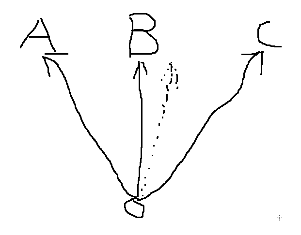

---
  前几天做通信原理的实验，发现网上关于维特比算法的解释太理论化，我结合代码通俗话的解释一下。如果看了以下代码您还是不能理解维特比纠错算法的真实目的，算我输!
  
  首先，我问大家一个问题，如下：

  A，B，C代表三个地点，三条实线代表路径。假设张三现在要去A、B、C的其中一个地方，由于淘宝上买了一个劣质的指南针，方向出了偏差，虚线是他走过的路，我们不知道到底偏了多少。我们以上帝视觉**猜测**张三的目的，显然：**看上去张三的目的地好像是B**。如果我们信赖这个指南针(偏的并不离谱),那么我们的结论也许就是对的。

  **注意哦**,我们的结论是根据最近的地点距离猜得，并不是非常准确，也就是说张三的目的地是A也是有可能的，即:**指南针偏的的太多了**   

  这里的"偏的太多了"，在通信上可以认为信息在传输过程受到了非常大的干扰，导致接收到的信息已经面目全非，想要恢复原有信息的话已经不太可能。  

  这就是维特比算法的一部分,**根据汉明距离来选择最有可能通往下一个节点的路径**。所以说，如果信息位错的太离谱了，它就不可靠了，这个太离谱是有一个**度**的，具体是多少，您可以参考下面的代码做个实验。  

  对了！如果您不知道什么是**汉明距离**，那么您可以直接关掉这个页面了。
