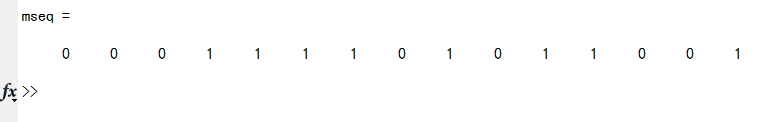

---
  前几天做通信原理的实验，发现网上关于维特比算法的解释太理论化，我结合代码通俗话的解释一下。如果看了以下代码您还是不能理解维特比纠错算法的真实目的，请务必联系我！
  
  首先，我问大家一个问题，如下：

  A，B，C代表三个地点，三条实线代表路径。假设张三现在要去A、B、C的其中一个地方，由于淘宝上买了一个劣质的指南针，方向出了偏差，虚线是他走过的路，我们不知道到底偏了多少。我们以上帝视觉**猜测**张三的目的，显然：**看上去张三的目的地好像是B**。如果我们信赖这个指南针(偏的并不离谱),那么我们的结论也许就是对的。

  **注意哦**,我们的结论是根据最近的地点距离猜得，并不是非常准确，也就是说张三的目的地是A也是有可能的，即:**指南针偏的的太多了**   

  这里的"偏的太多了"，在通信上可以认为信息在传输过程受到了非常大的干扰，导致接收到的信息已经面目全非，想要恢复原有信息的话已经不太可能。  

  这就是维特比算法的一部分,**根据汉明距离来选择最有可能通往下一个节点的路径**。所以说，如果信息位错的太离谱了，它就不可靠了，这个不离谱是有一个**度**的，具体是多少，您可以参考下面的代码做个实验。  

  对了！如果您不知道什么是**汉明距离**，那么您可以直接关掉这个页面了。
  
  
  好了，接下来我们来模拟一下整个信息传输过程,我默认您已经掌握了一定的原理，知道什么是M序列、卷积码等。
  
### 第一步：产生M序列

```matlab
    function [mseq] = m_sequence(fbconnection,register)
    n=length(fbconnection);
    N=2^n-1; 
    mseq(1)=register(n);        %m序列的第一个输出码元
    for i=2:N 
        newregister(1)=mod(sum(fbconnection.*register),2);
        for j=2:n 
            newregister(j)=register(j-1);
        end;
        register=newregister;
        mseq(i)=register(n);
    end    
```

其中fbconnection就是我们要发送的信息，它被认为是M序列的特征方程的阶次。

我们把它定义成函数，将这个文件命名为:createMsequence.m,在matlab中，输入：vector = createMsequence(...,...)就可以产生一个信息段对应的M序列。示列：

```matlab
    mes = [1 0 0 1];   %我们要发送的信息,我这里假设是4位，当然不论多少位都是可以的
    init = [1,zeros(1,length(mes)-1)]; %寄存器初始值
    mseq = createMsequence(mes,init);  %调用之前我们写的代码
```

#### 运行实例:


   
### 加密、卷积

我们先随机产生一个和M序列等长度的01码，我们把这个序列认为是密码子，也就是说接收方如果想要结算它接收到的信息，必须依靠这个密码子。

#### 加密
    secret = randint(1,length(mseq));

加密函数就简单点，直接异或吧。

    mseq = bitxor(mseq,secret);

我们现在再来看一下差异。


#### 卷积

然后我们再对这个序列进行卷积,我采用的是最简单的3,1,3卷积:

```matlab
    function [out] = conv(vector);
    len = length(vector);
    b1 = vector(1);
    b2 = 0;
    b3 = 0;
    for i = 1 : len 
        c1 = b1;
        c2 = xor(b1,b3);
        c3 = xor(xor(b1,b2),b3);
        out(3*(i-1) + 1) = c1;
        out(3*(i-1) + 2) = c2;
        out(3*(i-1) + 3) = c3;
        b3 = b2 ;
        b2 = b1 ;
        if(i<len)
            b1 = vector(i+1);
        end
    end
```

这是3,1,3卷积编码的实现，具体的实现框图我相信您肯定知道的，不难的，不就是一个迭代么。


