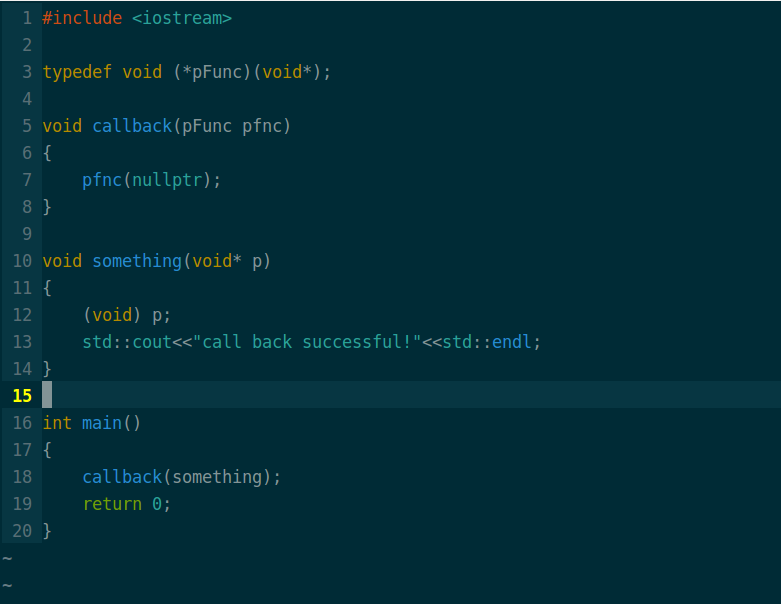
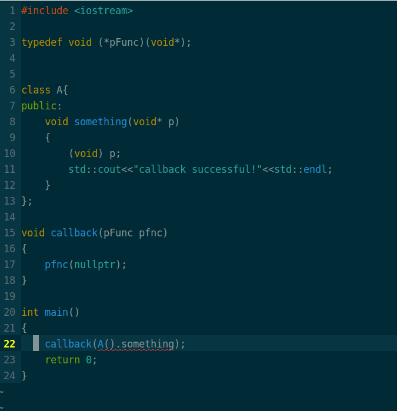
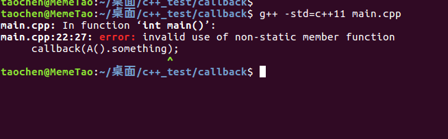
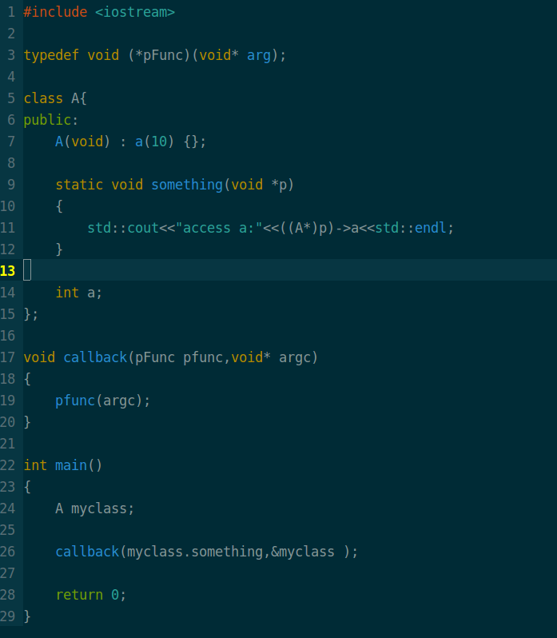

---
今天在公司实习，领导为了让我熟悉公司底层服务端架构，给我两天时间写一个基于当前平台的多线程收发消息的Demo。我参考项目中的旧代码编写这个Demo，平台上有个接口是注册回调函数的，我参照接口函数参数类型一一编写，最后碰到一个编译错误，百思不得其解，后来是同事提醒这里需要加个static关键字，他说C++回调函数必须是static，我一脸茫然。他让我去看static关键的作用，我说我都知道呀，static嘛，balabala.....。他说对啊，所以这里要加static。我还是一脸茫然，为了不暴露我**菜**的事实，只好点头说是。下班后深究之下，终于发现了问题根源,同事说的并不是全对。

**本次发现的问题: C++类成员函数不遵守默认函数调用约定(__cdecl),因为要传递this指针**

看下面的例子:
### 普通的回调:

很正常，函数正常运行。
### C++成员函数作为回调函数

现在我们来看，**当回调的函数是某个对象的成员函数的时候**



我们编写类成员函数类型，和接口要求的回调函数参数类型**“完全一样”**,好，我们编译一下：



为什么会这样？函数指针不都只这么用的么，而且怎么还和static搭上了关系？根据编译器的提示，我上网找资料，终于发现了症结所在，算是今天最大的收获了！

### 找原因
要从C++对象模型说起，**this指针**。我们知道,普通的C++类,其成员函数是类的所有对象共享的,而数据时每个对象所独有的.即:**数据独有,方法共享**。因此在调用类的某个成员方法(非静态方法)时,我怎么知道是哪个对象调用的呢?此时就是通过this指针来区分的，通过this指针我可以区分是该类的哪个对象正在调用该成员方法。

这里不得不提一下这次的另一个收获：**函数调用约定**，下面是其中三种:

> 1、__cdecl
    __cdecl调用约定成为C调用约定，是**C/C++语言缺省的调用约定**。参数按照从右至左的方式入栈，函数本身不清理栈，返回值在EAX中，允许可变参数函数存在，如：int printf(char* buffer,const char* format,...);

> 2、__stdcall 函数自身清理栈。

>  3、__thiscall 这是C++语言特有的一种调用方式，用于类成员函数的调用约定。如果参数确定，this指针存放于ECX寄存器，函数自身清理堆栈；如果参数不确定，this指针在所有参数入栈后再入栈，调用者清理栈。__thiscall不是关键字，程序员不能使用。

C++类成员函数调用时，实际传递了**this**，如:

```c++
    Class A;
    A.func(); //在编译器看来，A::func最终会转化成 Type func(A *this);
```

这样看来，我们找到了编译器提示错误的原因，**仅仅是函数参数类型不匹配而已!**

### 解决方式
#### 1、用static修饰类成员函数,并且改变调用接口

但是，问题又随之而来，我们的回调函数是类的成员函数的目的之一：希望通过这个函数来访问对象的资源。但是，**我们函数又是static的，只能访问静态数据成员**，怎么办？看来显式传递this指针无法避免，即：修改接口，另外加一个参数,用以放置this，如:



这种解决方式勉强可用把，但不是很满意！

#### 2、肯定还有其他方法，暂时没想出来，哈哈哈！

