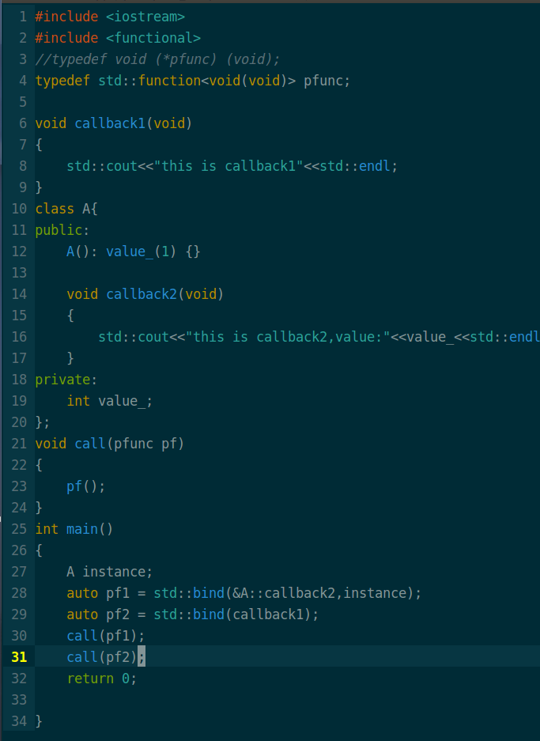

---

### 这篇文章主要记录一下std::function<>和函数指针。

<font size = '4'> 补上一篇关于回调函数的文章遗留问题，时隔一个月，偶然间在Muduo源码中看到了使用boost::funcion<>模板类来回调函数，统一了normal funcion和non-static member funcion。关于这个功能在C++Primer上也有介绍，痛恨自己之前阅读C++Primer的时候竟然没留意这个功能。最近发现自己废话有点多，不多说了，按照惯例直接先上代码：当回调函数是C++  non-static member function。  </font>



```c++ 
运行结果：
$   this is callback2,value:1
$   this is callback1
```

很明显哦，这个问题的第二种解决方式(不使用static)已经找到。

### 下面开始说**function<>和函数指针的联系

