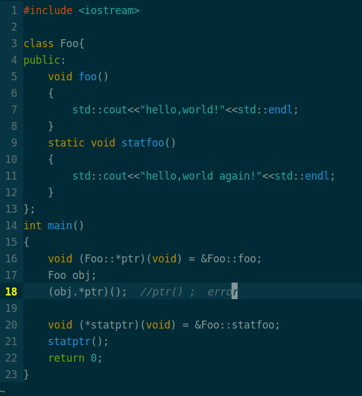

---

### 这篇文章主要记录一下std::function<>和函数指针。

<font size = '4'> 补上一篇关于回调函数的文章遗留问题，时隔一个月，偶然间在Muduo源码中看到了使用boost::funcion<>模板类来回调函数，统一了normal funcion和non-static member funcion。关于这个功能在C++Primer上也有介绍，痛恨自己之前阅读C++Primer的时候竟然没留意这个功能。最近发现自己废话有点多，不多说了，按照惯例直接先上代码：当回调函数是C++  non-static member function 的另一种解决办法。  </font>


```c++ 
运行结果：
$   this is callback2,value:1
$   this is callback1
```

很明显哦，这个问题的第二种解决方式(不使用static)已经找到。

上面这个例子中，如果我们把pfunc的类型换成普通成员函数指针(也就是把第三行注释去掉,注释第四行)，由于要类成员函数要传递this指针的缘故，不允许这么干，具体看我上一篇博客中说明。

### 下面开始说C++中的函数指针

废话不多说，直接上一个例子:



注意看普通成员函数指针的写法，以及调用方式。

static将改变函数访问方式，以至于可以用普通函数指针来指向它。

我对其中的原理并不是了解的很清楚，《深入探索C++对象模型》一书中估计可以找到详细的答案。

