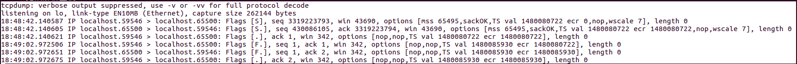

---

### 问题
我在给多线程TCP服务器写被动关闭逻辑时遇到了一个疑问，Poll返回的时机是什么时候？TCP四次挥手能够引起几次Poll返回？
### 如何引入的问题
一般的服务器编程逻辑，一般是由客户端发起的主动关闭，服务端实行被动关闭。按正常的流程是这样的:对端发送FIN，服务端发送ACK，如果没有多余数据，随即再发送FIN分节，对端继续发送ACK便进入熟知的TIME_WAIT状态，等待2MSL时间后进入CLOSE状态，本次TCP连接顺利断开。依照这个模型，我们只要在fd上注册一个回调函数，等poll返回时，用read系统调用即可判断是正常数据还是FIN分节，很容易得到如下回调函数伪代码:
```c++
void handleRead()
{
    ssize_t n = read(fd); 
    if( n > 0) //对端发来信息
    {
        //正常处理信息
    }
    else if(n == 0) //说明对端发送了FIN分节
    {
        addTask(freeMemory);//让其它空闲线程来处理这个连接的资源
        close(fd);          //发送FIN
    }
    else
        Error();
}
```
上述代码在实际的运行时，发生了错误，操作系统提示我一个关键词：**double free**

### 寻找症结

根据提示:我猜测是某些资源释放了多次。在多次复现问题后，最终发现这个问题出现在TCP连接断开的时候。

我用Linux下的NC工具模拟了客户端TCP连接，并用tcpdump试图分析出一点蛛丝马迹：
```shell
    $ ./TcpServer -l 65500     //在本地65500端口启动服务器
    $ nc 127.0.0.1 65500       //连接到服务器65500端口
    $ Ctrl-D                   //一段时间后，NC主动断开连接 
```
以下是tcpdump本地抓包结果：

首先是TCP三次握手，随后等我键入Ctrl-D断开连接，TCP四次挥手也很正常(由于FIN分节携带了ACK，所以表现出来是3个报文),然后服务端依然奔溃，并提示double free!

用netstat命令显示的TCP状态变化:

protocol |       port1       |      port2        | status
---------| ------------------| ------------------|--------------
tcp      |  ---65500---  | ---59580---   | -----ESTABLISHED
tcp      |  ---59580---  | ---65500---   | -----TIME_WAIT

说明连接是正常建立，正常断开的，一切都很正常!看来是一场硬仗，得调试代码了，由于当前还没有加入日志模块，用gdb又好像有点小题大作，先用printf大法试一下再说，最终发现**在TCP四次挥手中，read() = 0 返回了两次！**

### 引起poll返回的事件

根据我的代码结构，回调之前是poll，随即开始查资料，在《APUE》中发现，以下条件是引起poll返回的特定revent:
* 有数据可读，专业的说法是：套接字接收缓冲区中的数据字节数大于等于套接字接收缓冲区低潮限度的当前值。可以使用套接字选项SO_RCVLOWAT来设置低潮限度，对于TCP和UDP套接字，其值缺省为1
* 连接的读这一半关闭，也就是说接收了FIN的TCP连接。对这样的套接字的套接字将不阻塞且返回0（即文件结束符）
* 套接字是一个监听套接字且已完成的连接数为非0，即连接建立后可读
* 有一个套接字错误待处理。对这样的套接字的读操作将不阻塞且返回一个错误（-1），errno则设置成明确的错误条件。这些待处理的错误也可以通过指定套接口选项SO_ERROR调用getsockopt来取得并清除。

<<UNP>>还有如下补充:
* 所有TCP和UDP正规数据都被认为是普通数据
* TCP的待外数据被认为是优先级带数据
* 当TCP连接的读半部关闭时(譬如收到一个对端的FIN)，也被认为是普通数据，随后的读操作将返回0
* ...

**那客户端进入TIME_WAIT状态时发送的最后一次ACK是不是一次普通数据呢?**在这个情况下，没有其它什么事件能够引起poll返回了，很明显了，罪魁祸首就是**TCP四次挥手的第四次ACK！**
### 问题的关键以及解决方案
之所以会出现这样的问题，是由于我的代码执行顺序的问题，由于是多线程，一个线程close(fd)使得tcp发送FIN分节，理论上，再此之前我们就应该注销掉这个连接的资源了。而我的代码试图将资源释放这个问题推迟一些以便于处理当下更紧急的其它任务，所以在poll所关注的事件列表中还有这个连接所关注的事件，所以引起了这个问题。清楚了原因之后，立马找到了解决方案：我只要注销掉poll中的该事件对应的fd即可，依然可以使得资源释放稍后执行。

* 方案一：具体是在read()返回0，后随机注销掉该socket_fd的一切事件。伪代码描述如下:
```c++
if(read() == 0)
{
    pollfd.events = 0;   //如果不懂,请查阅struct pollfd
    addTask(freeMemory); //让其他线程来处理该连接的资源
    close(fd); 
}
```
* 方案二:一个TCP连接的所以资源自始自终都由某一个线程管理，不要转移fd。

我修改了代码，两种方案都可以达到预期目标，考虑代码结构的问题，我采用了方案二。
### 总结
解决了上述问题后，我反思自己:当初看APUE和UNP的时候对上述问题之所以没有留下深刻的印象，原因恐怕是没有实际情况作为参照。想起一句名句:**纸上得来终觉浅，绝知此事需躬行**
