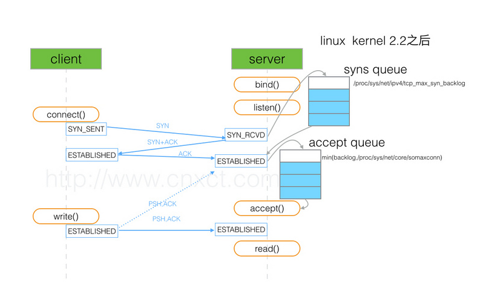

---

### 一、问题
最近在写一个TCP多线程服务器，模型是这样的：1个线程接受TCP新连接，从线程池中挑出一个EventLoop线程给这个TCP连接，以后这个TCP连接的所有操作都将由这个EventLoop线程负责。我疑惑的点是：**仅由一个线程accept新连接，够么？能够处理多少并发量？**

### 二、分析问题
已经知道的知识是，TCP有个半连接队列和已连接队列(等待应用层accept)，如下：

(图片来源:https://segmentfault.com/a/1190000008224853)
* SYNC队列:长度为 max(64, /proc/sys/net/ipv4/tcp_max_syn_backlog)，在我的机器上，后者的值是:128
* ACCEPT队列:长度为 min(backlog, somaxconn)，/proc/sys/net/core/somaxconn的值为128，表示最多有129的ESTABLISHED的连接等待accept()，而backlog的值则应该是由int listen(int sockfd, int backlog)中的第二个参数指定，listen里面的backlog可以有我们的应用程序去定义的。
#### 2.1当sync队列满了
当这个队列满了，不开启syncookies的时候，Server会丢弃新来的SYN包，而Client端在多次重发SYN包得不到响应而返回（connection time out）错误。但是，当Server端开启了syncookies=1，那么SYN半连接队列就没有逻辑上的最大值了，并且/proc/sys/net/ipv4/tcp_max_syn_backlog设置的值也会被忽略。
#### 2.2当accept队列满了
当accept队列满了之后，即使client继续向server发送ACK的包，也会不被响应，此时ListenOverflows+1，同时server通过/proc/sys/net/ipv4/tcp_abort_on_overflow来决定如何返回，0表示直接丢弃该ACK，1表示发送RST通知client；相应的，client则会分别返回read timeout 或者 connection reset by peer。
#### 2.3如何查看是否存在队列溢出
```shell
netstat -s | grep "listen|LISTEN"
```
由于我电脑不是服务器，没有溢出的情况，暂时不能举例。
#### 2.4如果客户端第三个ACK已达到，但是服务端没有accept，且客户端发送了信息，这时发生什么?
我没有做相应的实验，查资料得知，服务端不做任何响应，客户端超时重传，直至断开连接。

### 三、单线程accept的极限参数
现在我们可以得到的结论是，高并发下，上述的队列参数的确会限制TCP并发连接数。可是具体参数是多少呢？我暂时不得而知，但我不久便会做个相应的实验(认真脸)!

今天做了测试，模型是这样的: **一个线程专门poll监听描述符号，有新连接就accept，然后将新fd交给其它线程，继续poll+accept**

#### 测试记录
* **电脑参数**：双核+i5+4G 普通家用电脑
* **发起连接数**:50个进程，每个进程发起200个TCP连接，总共10K个连接，目标是 127.0.0.1:65500，发起连接后不管有无成功等待10S后，退出进程。
* **服务端**:监听65500端口，来一个接收一个。
* **现象**:服务端syn和accept队列被挤满，"netstat -s ]  grep listen"发现大量overflowed, ，1S内接收的TCP连接，最大时达到1200。
* **问题**:有时服务端会残留少量已连接TCP ，netstat ] grep localhost*.65500 可看到该问题 。可是客户端都已经关闭了，按理说每个连接都发送FIN分节。更加有意思的是，若在发起几波TCP连接，这些残留TCP会自动被服务端注销。


#### 对测试结果的总结与思考
* 关于残留TCP连接，我怀疑是Localhost的原因，由于数据量真的有点大了，我没有很好的办法追踪这个问题，只能暂时留个坑了。好在，结果是正确的，影响很小。
* 将poll换成epoll，如果仅仅是对于提高“接收TCP新连接”性能来说可能帮助并不大，因为要监听的端口号仅1个。
* 测试结果和电脑硬件有一定关系，但是数量级肯定是K级别，由于本地瞬间出现了大量的临时进程(50个发起10000TCP连接的进程），大量占用了CPU时间，所以实际上的结果肯定是偏小的。
* 因为是localhost，不经过数据链路层、网络层，有一定影响，但不大(猜测）
* 由于连接的断开也是该线程负责，但是每个客户端都预留了10S维持该连接，所以，poll+accept 循环间隔已经很短了。所以，测试的结果和可信。
* 如果以后有机会，换台高配主机，远程发起连接，再测试一回(认真脸)
### 四、有没有必要？
好了，现在继续。有了单线程accept的数据，我做大胆的分析：**如果是为了提高TCP新连接并发数，多线程accept是可以的。**
假设我们的目标是使得单机承受100W个并发连接，并假设服务端成功的接收了上述的100W客户。
#### 4.1我们先计算几个参数
* 服务端1s内给所有客户发送一个hello,world!报文占用的带宽:
* 上述连接占用的内存

#### 4.2内核是否能承受？

### 五、结论
未完待续~~~2018-1-29
我暂时还是无法得出结论，但是主流网络库都是1个线程进行accept。我还会继续在这个问题上学习，网络上关于这个问题的讨论，真知灼见貌似寥寥无几。未完待续~~~2018-2-10
