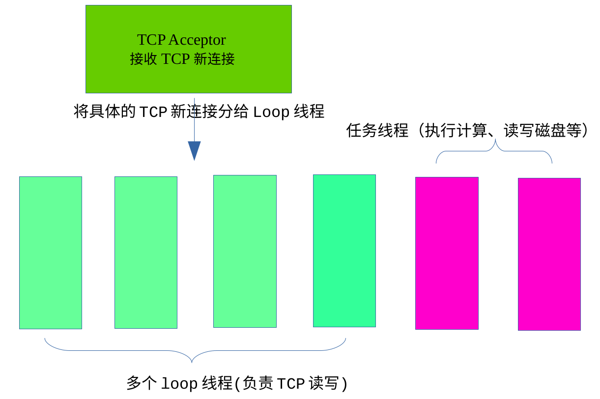
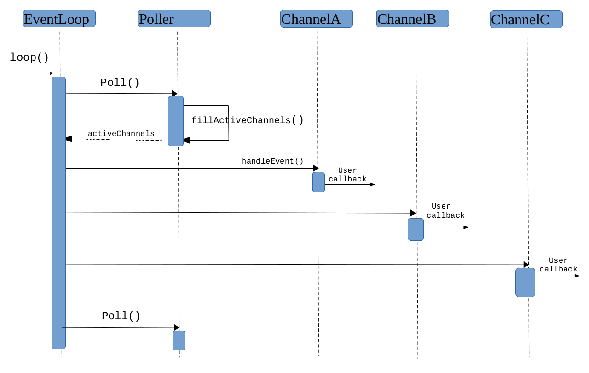

---
2018-2-13 更新：完善reactor部分描述

2018-2-27 更新：tcp 部分描述的不太清楚，删掉重改

**我试图用几千字描述完我这一个月的学习成果，所以，很多地方只能做个大致介绍。**
### 服务器总体结构


* **为什么要采用多线程结构？可以带来哪些优势？**
因为现在的CPU都是多核，线程比较廉价。多线程结构可以提高响应速度，让IO与计算相互重叠，降低latency。
* **多线程带来的编程复杂性怎么解决?**
One loop one thread！使得线程间的耦合降到最低，仅少数地方加锁。

#### 我主要分三部分介绍，Reactor事件循环、定时器、TCP服务器

### 第一部分 Reactor事件循环
reactor由三个基本的类购成，EventLoop、Poller、channel，前者是后者的数据成员。
#### EventLoop的功能:找出活动的事件，执行该事件的回调。
EventLoop的一个样子:
```c++
class EventLoop{
    loop();
    Poller poller_;
};
void EventLoop::loop()
{
    while(true)
    {
        activeChannels;
        poller_(&acctiveChannels);//将活动事件填充到activeChannel
        for(auto it : activeChannels)
            it->handleEvent();              //执行对应事件的回调	
    }
}
```
暂时将poller看作是一个黑盒子，下文介绍。
事实上，EventLoop还有一些非常重要的数据管理函数，如runInLoop():它可以在线程间分配任务,起到消除race condition的作用，我稍后介绍。
#### Poller的功能：监视所有建立的文件描述符(fd)，找出其中处于活动状态的fd.
Poller的样子：
```c++
class Poller{
    poll();
    fds_;    //所有fd
    map<int,Channel*> channelMap_; //每一个fd对应的channel
};
void Poller::poll(int timeoutMs,ChannelList* activeChannels)
{
    int numEvents = ::poll(&*fds_.begin(),fds_.size(),timeoutMs);
    if(numEvents >0 )
    {
        fillActiveChannels(numEvents,activeChannels);
    }
}
```
Poller::poll最终调用Linux IO multiplexing函数poll，可以使用epoll提高性能。
暂时将其中的channel看作是黑盒子，它的功能是：事件分发，即回调该fd上活动事件，如tcp可读、定时器超时。
事实上，Poller还有一些非常重要的数据管理函数，有兴趣的可以查看代码。

#### Channel的功能：事件分发
```c++
channel的样子：
Channel{
    handleEvent();
    EventLoop*  loop_;      //所属的Loop
    int fd;                 // 对应的文件描述符
    int events_;            //关注的事件
    int revents_;           //该文件描述符上正在发生的事件(由poll得知)
    CallBack readCallback_; //回调函数
    CallBack writeCallback_;
    CallBack errorCallback_;
};
//以fd可读为例
void Channel::handleEvent()
{
    //poller会将revents_更新
    if(revents_ & (POLLIN | POLLPRI | POLLRDHUP) //说明fd上出现可读事件
        readCallback_();  //执行相应的回调
}
```

**以上三个类及其简陋，但是构成了Reactor的核心结构，请看时序图**

我大致描述一下上面的过程:**首先，loop调用poll()进入内核，内核返回活动的fd,并将每一个活动的fd所发生的事件类型记录在revents_上。一个fd对应一个channel(poller中)，因此我们可以快速找到channel，并根据channel的revents_执行对应的回调函数。**

PS:如今回过头来看，发现Reactor也就是这么一回事儿。
### 第二部分 定时器
一个网络程序，少不了定时器功能。为了将定时器融入上述的Reactor模式，我使用了Linux timerfd，这会使得代码一致性更好，因为我们可以用一个fd代表一个timer，从而融入evnetloop。
Linux 新增的timer_create()用来创建一个定时器,详见：http://man7.org/linux/man-pages/man2/timer_create.2.html
用法是这样的：我创建一个定时器，返回一个fd，当超时到来时，fd变为可读，在fd上读取8个字节，内核会取消该定时器的超时事件。

考虑一个问题，假设当前时间是AM6.00我有需要在PM 10.00、PM 11.00、AM 7.20、AM 8.36定点执行任务，我应该怎么办？直接的做法是创建四个定时器。但是如果业务复杂，定点任务非常多，需要1000个定时器怎么办？注册1000个是不是会严重拖累内核?正确的做法是：仅仅注册时间离当前时间最近的定时器。上例中，我们仅需要注册AM7.20。当7.20时，我们先不执行回调，而是将定时器时间换为AM8.36，然后再去执行回调。这样，内核任务就不重了。我用std::set管理定时器，取出离当前最近的定时器，仅需要O(Log N)，很高效。取出超时定时器的时候需要特别注意：**从我们发现定时器超时到取定时器的这段时间里，可能已经有新的定时器超时了，因为我们可能在其他地方耽误了一些时间。所以我们先要获取一下当前时间，然后使用set<T>::lower_bound()函数，一次性取出所有早于当前时间的定时器。**
```c++
class TimerQueue{
    typedef std::pair<Timestamp,std::shared_ptr <Timer> >Entry;
    typedef std::set< Entry > TimerList;
public:
    TimerQueue(EventLoop* loop);
    ~TimerQueue();
    void addTimer(Timestamp& when,double interval,const TimerCallBack&);//新增定时器
    std::vector<TimerQueue::Entry> getExpired(Timestamp& now);         //取出超时的定时器
private:
    void handleRead(void);  //timerfd_ 可读的处理入口
    void addTimerInLoop(std::shared_ptr<Timer>);                        
    bool insertTimer(shared_ptr<Timer> timer);
    void reset(std::vector<Entry>&,const Timestamp&);                  //重置定时器
    EventLoop* loop_;                                                  //所属Loop
    const int timerfd_;                                                //即将超时的定时器
    Channel timerfdChannel_;                                           //为了融入loop，需要channel
    TimerList timers_;
};
```
定时器部分总体思路就是这样子的，不多介绍了。

**ps:在如今的X86上，取得时间已经不是系统调用。**
### 第三部分  TCP服务器

有了以上的reactor结构，构建一个tcp server的任务就轻松了一些，只是相对轻松一些。
考虑下面问题：
* 1、可否将一个tcp连接的fd，暴露给多个线程？考虑一个场景，线程1正在往fd写数据，线程2检测到了该fd的FIN，执行被动关闭，调用了close(fd),这意味着所有与这tcp连接相关的资源都将一一释放，线程1怎么办？这时候，进程奔溃恐怕是最好的结果。当然，我们也可以使用shared_ptr<T>包裹这个tcp connection，当connection.use_count() > 1时，线程2 sleep()一会，sleep()正确么？又该sleep()几秒呢？恐怕行不通。
* 2、如果两个线程同时read一个fd,两个线程各自收到一部分数据，怎么合并成一条完整的数据？
* 3、一个更糟糕的问题：一个线程正准备read某个socket,而另一个线程close()了此socket，第三个线程恰好open()了另一个文件描述符，其fd恰好与前面的socket相同。这时候，恐怕要串话了！	

**因为是多线程环境，如果框架不合理，资源的安全释放很难做到。**

我分几部分介绍TCP SERVER：
* 单线程环境下 Acceptor连接器、TcpConnetion连接类、TcpServer类
* TCP连接的断开
* TCP读写
* 应用层Buffer
* 多线程前置准备：RAII互斥锁、条件变量、线程池
* 多线程环境下的 Acceptor连接器、TcpConnetion连接类、TcpServer类的改动
* 多线程下的TCP连接的断开和TCP的读写
### 单线程环境下Acceptor接收TCP连接
```c++
class TcpAcceptor{
public:
    TcpAcceptor(EventLoop* loop,const InetAddress& listenAddr);
    void listen();
    void handleRead();
    void setCallback(const NewConnectionCallback&& cb) { callback_ = std::move(cb);}
private:
    EventLoop* loop_;
    Socket acceptSocket_;
    Channel acceptChannel_;
    NewConnectionCallback callback_;   //连接后的回调
    bool listening_;
};
```
这个类用来接收TCP连接，过程如下：
* 1.创建非阻塞套接字,fd = socket();
* 2.将fd添加进EventLoop(通过Channel可以轻松做到)，设置回调函数:handleRead
* 3.监听这个套接字,listen(fd);
* 4.等到fd可读，说明三次握手已经成功。
* 5.利用accept获得一个TCP连接，交给Loop
以下为各个步骤代码:
``` c++
//步骤1.2
TcpAcceptor::TcpAcceptor(EventLoop* loop,const InetAddress& listenAddr)
    :loop_(loop),
    acceptSocket_(),
    acceptChannel_(loop_,acceptSocket_.fd()),
    listening_(false)
{
    acceptSocket_.setReuseAddr(true); //Ip别名
    acceptSocket_.setReusePort(true); //惊群现象
    acceptSocket_.bindAddr(listenAddr);
    acceptChannel_.setReadCallback(std::bind(&TcpAcceptor::handleRead,this));
}
//步骤3
{
    acceptSocket_.listen();
    acceptChannel_.enableReading();
}
void Socket::listen(void)
{
#ifdef SOMAXCONN
    ::listen(fd_,SOMAXCONN);
#else
    //下面是《UNP卷一》确定的方法
    int backlog = 0;
    char* ptr = getenv("LISTENQ");
    if(ptr != nullptr)
        backlog = atoi(ptr);
    else
        backlog = 128;  //Linux version 4.10.0-42-generic 
    ::listen(fd_,backlog);
#endif
}
//步骤4,fd可读，执行回调函数
void TcpAcceptor::handleRead()
{
    InetAddress clinetAddr;
    int fd = acceptSocket_.accept(clinetAddr);
    if(fd > 0)
    {
        if(callback_)
            callback_(fd,clinetAddr);
        else
            ::close(fd);
    }
    else  //accept失败
    {
        int err = errno;
        switch(err)
        {
           //暂时没有出错回调
           //<<UNP卷一>>建议忽略以下这种异常情况
           //即：客户在服务端accept之前发送RST
        case EWOULDBLOCK:   //Berkeley
        case ECONNABORTED:  //POSIX
        case EPROTO:
        default:break;
        }
    }
}
//最后一步：把这个“连接”交给loop，通过上述的回调函数:callback_(fd,clinetAddr)
void TcpServer::newConnetion(int fd,const InetAddress& addr)
{
    //用到了TcpConnection\TcpServer类，稍后介绍
    shared_ptr<TcpConnection> newConn = std::make_shared<TcpConnection>(loop_,fd,addr);
    assert(connections_.find(fd) == connections_.end());
    connections_[fd] = newConn;
    if(messageCallback_)
    {
        newConn->setMessageCallback(messageCallback_);
    }
    newConn->setCloseCallback(std::bind(&TcpServer::removeConnection,this,_1,_2));
    newLoop->runInLoop(std::bind(&TcpConnection::established,newConn));
    //...
}
```
这样以后，loop会对负责这个连接上的任何事件。
### TcpConnection类
(未完待续...)
### 以下为草稿
这是TCP Server单线程时候的样子：
```c++
class TcpServer{
public:
    TcpServer(InetAddress listenAddr);
    void setMessageCallback(const MessageCallback&& cb);
    void removeConnection(int fd,EventLoop* loop); 
    void stat();
private:
    void newConnetion(int fd,const InetAddress& addr);
    std::shared_ptr<EventLoop>   loop_;
    std::shared_ptr<TcpAcceptor> acceptor_;
    ConnectedMap                 connections_;

    MessageCallback              messageCallback_;
};
void TcpServer::newConnetion(int fd,const InetAddress& addr)
{
    shared_ptr<TcpConnection> newConn = std::make_shared<TcpConnection>(loop_,fd,addr);
    connections_[fd] = newConn;
    newConn->setMessageCallback(messageCallback_);
}
```
三言两语说清楚太不容易了，一个简化的过程是这样的：当新连接到达时，acceptor会回调newConnection(),实例化一个TCP连接对象，并记录。TCP连接对象:TcpConnection。它会接管该具体的TCP连接，因为accept()会返回一个fd，我根据这个fd，创建一个channel，添加到eventloop中。这样，当这个tcp连接的读写事件到达时，就可以根据channel执行对应的回调了,比如tcp fd可读：
```c++
void TcpConnection::handleRead()
{
    int n = read(fd_);
    if( n > 0)
    {
        messageCallback_(shared_from_this(),inputBuffer_,socket_->fd());
    }
    else if(n == 0) //FIN 分节
    {
        handleClose();
    }
    else
    {
        handleError();
    }
}
```
#### tcp读写
* 读取就是上述的messageCallback();
* 写就比较麻烦了，涉及到socket缓冲区的问题。只能再开一篇文章介绍:https://memetao.github.io/TcpBuffer/
#### 应用层Buffer 
举个例子：我们往fd写100KB数据，但是涉及缓冲区的问题，我们也许只能写入64KB，剩下的数据怎么办？程序不可能等到这里直到TCP把64KB发送出去。应用程序的编写者不希望自己的程序阻塞在这里，他要抽身去忙活其他的事情。所以就需要一个Buffer缓存剩下的36KB数据，监视tcp fd，等到tcp发送完64KB数据，会使得可读事件发生，立即将36KB数据写入。这样子，在应用程序的编写看来，他是一次性完成了100KB的数据的写入的，他只需要调用buffer.write(data)，我们的tcp服务器程序会接管剩下的数据。
#### 解码器接口
举个例子：
* 当对端写入一条信息，但是发生了tcp分包，数据不是一次性的到达服务端，但是服务端会接收到达的每一段数据，如何知道一条的消息已经到达?
* 当服务端繁忙时，某一个tcp连接达到的数据可能已经包含好几条消息，等到应用层read()，这时，我们怎么分开数据?
#### 多线程前置准备
##### RAII互斥锁(待写)
##### RAII条件变量(待写)
##### 线程池(待写)
#### 引入多线程
```c++
//新增部分
class TcpServer{
public:
    void setThreadNum(int loopThreadNum,int taskThreadNum );
    void removeConnection(int fd,EventLoop* loop); 
    //给用户提供线程池,方便配送任务
    std::shared_ptr<ThreadPool> getThreadPool() { return threadPool_;} 
private:
    void removeConnInLoop(int fd,EventLoop* loop);
    std::shared_ptr<ThreadPool>  threadPool_;
};
```
说明：
* 引入线程池，使得tcp server直属loop仅接收tcp连接。
* 对于每个新来的连接，我都为其分配一个loop线程，采用循环分配的方式，平衡每一个线程的压力
* 由于每一个tcp连接仅属于某一个线程，故大大减少的多线程编程的复杂性

#### 多线程环境下接受tcp新连接
来一个tcp连接，我们要做的是为其分配一个Loop线程，并配置好回调函数
```c++
void TcpServer::newConnetion(int fd,const InetAddress& addr)
{
    loop_->assertInLoopThread();  //断言检查是否为所属Loop线程
    EventLoop* newLoop = threadPool_->getLoop(); //获取一个Loop线程
    if(newLoop == nullptr)        //线程池里面没有LoopThread,也就是单线程模式
    {
        newLoop = loop_.get();    //使用主线程的Loop
    }
    shared_ptr<TcpConnection> newConn = std::make_shared<TcpConnection>(newLoop,fd,addr);
    assert(connections_.find(fd) == connections_.end());
    connections_[fd] = newConn;

    newConn->setMessageCallback(messageCallback_);
    newLoop->runInLoop(std::bind(&TcpConnection::established,newConn));
}
```
#### 断开TCP连接
这是最复杂的。

