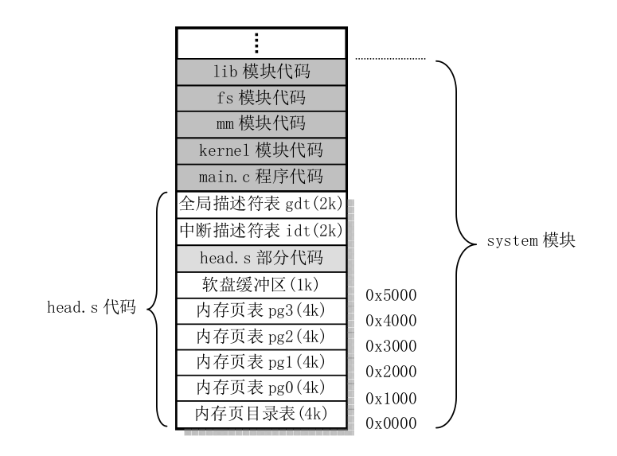
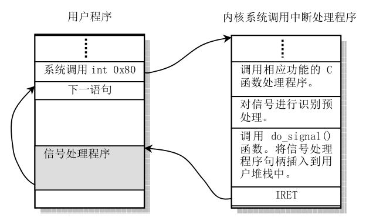

---

这将是一个漫长的过程，终将解答我心中的疑惑....
### step 0: 启动阶段
#### 磁盘引导
PC加电后，BIOS将引导扇区加载到内存0x7C00处(为什么是这个地址?是个业内约定)。

``` 
引导扇区:

Boot sector(引导扇区)是所有存储介质上的第一个扇区，大小为512字节。主要分为三个部分，分别是:
* 1. MBR(master boot record,主引导记录) 445字节
* 2. DPT(disk partition table,磁盘分区表) 64字节
* 3. BRID(boot record ID 引导记录标示) 2字节
#### MBR 
主引导记录的作用是安装基本的引导加载程序(boot loader),在Linux中是grub。grub的主要功能是：
* 1. 提供菜单：用户可以选择不同的开机选项，这是多重引导的虫咬功能。
* 2. 载入内核文件: 直接指向可开机的程序区段来开始操作系统
* 3. 转交其它Loader: 将引导加载功能交给其它loader处理
```

bootsect.s 是第一个被CPU执行的程序，这个程序先把自己从移动到0x90000处，接在吧磁盘中的setup.s弄到内存里来（具体的位置是0x920000)，然后把system模块移动到0x10000处，跳转到setup程序，setup.s程序又将system模块移动到内存起始地址。

```
bootsect.s,setup.s 为什么要移来移去的？

我们的目标是要将操作系统放到内存里去，最好的位置就是内存起始地址(0x0000)，但是在刚开始的时候，BIOS在那个内存起始处保存了中断向量和终端服务程序，所以在仍然需要用到BIOS功能之前我们不能直接将系统移动到那个地方去。

为什么是0x900000?

那时候system模块挺小的，0x0000000 ---- 0x900000 足够放置system模块代码。 

为什么是0x10000？

BIOS相关的的东西在 0x000000 --- 0x10000中。
```

### gdt,ldt,rdt表

setup.s 做了一系列的操作中，最重要的当然是这三个表的初始化，设置好代码段、数据段后程序就可以跑起来了,具体的细节涉及到"X86保护模式以及编程"。setup.s调用head.s代码，执行完后内存映像如下：

注：页表、描述符表等的初始化在head.s代码中

### 内核初始化main.c程序

#### trap_init()

Linux0.11 用过门描述符在idt表中放置了各种异常处理函数(具体操作是traps.c:trap_inti())，包括：除0，段错误等。当异常发生的时候，根据idt表中的段选择符找到中断处理函数，执行相应的处理回调，以除0为例：

```C++

#首先进入中断处理(涉及各类寄存器的处理，具体原理要看"X86保护模式及其编程")，执行asm.s中的"divide_error":

divide_error:
	pushl $do_divide_error # 接下来被调用
no_error_code:
	xchgl %eax,(%esp)      #寄存器处理
	pushl %ebx
	pushl %ecx
	pushl %edx
    ...
    ...
    iret                  #返回后，CS:EIP 可能已经被改变

void do_divide_error(long esp, long error_code)
{
	die("divide error",esp,error_code);
}

static void die(char * str,long esp_ptr,long nr)
{
	long * esp = (long *) esp_ptr;
	int i;

	printk("%s: %04x\n\r",str,nr&0xffff);
	printk("EIP:\t%04x:%p\nEFLAGS:\t%p\nESP:\t%04x:%p\n",
		esp[1],esp[0],esp[2],esp[4],esp[3]);
	printk("fs: %04x\n",_fs());
	printk("base: %p, limit: %p\n",get_base(current->ldt[1]),get_limit(0x17));
	if (esp[4] == 0x17) {
		printk("Stack: ");
		for (i=0;i<4;i++)
			printk("%p ",get_seg_long(0x17,i+(long *)esp[3]));
		printk("\n");
	}
	str(i);
	printk("Pid: %d, process nr: %d\n\r",current->pid,0xffff & i);
	for(i=0;i<10;i++)
		printk("%02x ",0xff & get_seg_byte(esp[1],(i+(char *)esp[0])));
	printk("\n\r");
	do_exit(11);		/* play segment exception */
}
```
可见默认的处理就是"打印出错地址，杀死当前进程"，然后重新调度起另一个进程(do_exit()中)。


### system_call 

系统调用是使用0x80中断，具体的原理是:在idt表中的第0x80(124)个索引中存放了一个DPL=3的陷进门(sched_init函数中)，所以用户态代码可以以特权级别3（DPL<=MIN(CPL,RPL))来访问这个陷进门。

```
set_system_gate(0x80,&system_call);

//dpl = 3 , 所以用户态代码可以通过这个门进入内核
//type = 15 陷阱门
#define set_system_gate(n,addr) \
	_set_gate(&idt[n],15,3,addr)
```
在system_call中根据系统调用号来决定调用哪一个系统调用函数，每个系统调用函数都存放在一个函数指针数组：sys_call_table中。

```C++
system_call:   
	cmpl $nr_system_calls-1,%eax
	ja bad_sys_call
	push %ds
	push %es
	push %fs
	pushl %edx
	pushl %ecx		# push %ebx,%ecx,%edx as parameters
	pushl %ebx		# to the system call
	movl $0x10,%edx		# set up ds,es to kernel space
	mov %dx,%ds
	mov %dx,%es
	movl $0x17,%edx		# fs points to local data space
	mov %dx,%fs
	call sys_call_table(,%eax,4)  #执行具体的系统调用
	pushl %eax
	movl current,%eax
	cmpl $0,state(%eax)		# state
	jne reschedule
	cmpl $0,counter(%eax)		# counter
	je reschedule       # 重新调度
ret_from_system_call:   # 在这里处理了"信号处理句柄"
    ...
    ...
    iret                # 可见，先处理信号（如果有的话），在执行用户程序
```

### 信号处理
任务的数据结构中信号部分:
```C++
struct task_struct {
    ...
    long blocked;	/*信号屏蔽码*/
	long signal;    /*当前发生的信号*/
	struct sigaction sigaction[32];
    ...
}

struct sigaction {
	void (*sa_handler)(int);  /*信号回调*/
	sigset_t sa_mask;         /*执行回调时的信号屏蔽码*/
	int sa_flags;             
	void (*sa_restorer)(void);
};
```

举个例子:

```C++
//进程A向进程B发送信号(sig)
//第一步是调用对应的系统调用，正真的执行函数如下：
//p 是对应的进程的任务结构指针
static inline int send_sig(long sig,struct task_struct * p,int priv)
{
	if (!p || sig<1 || sig>32)
		return -EINVAL;
	if (priv || (current->euid==p->euid) || suser())
		p->signal |= (1<<(sig-1));  //将指定进程的signal添加sig信号标记
	else
		return -EPERM;
	return 0;
}
//进程B执行系统调用(不管是主动还是被动，总是要执行)，将要返回的时候，会执行do_signal函数:
ret_from_sys_call:
	movl current,%eax		# task[0] cannot have signals
	cmpl task,%eax
	je 3f
	cmpw $0x0f,CS(%esp)		# was old code segment supervisor ?
	jne 3f
	cmpw $0x17,OLDSS(%esp)		# was stack segment = 0x17 ?
	jne 3f
	movl signal(%eax),%ebx
	movl blocked(%eax),%ecx
	notl %ecx
	andl %ebx,%ecx
	bsfl %ecx,%ecx
	je 3f
	btrl %ecx,%ebx
	movl %ebx,signal(%eax)
	incl %ecx
	pushl %ecx
	call do_signal    # 看下当前有没有人给我发送了信号
    ...
    iret
//do_signal函数比较复杂，主要作用是将信号处理函数(sa_handler)插入到用户态堆栈中去而不是在内核态运行
//这里比较奇妙
void do_signal(long signr,long eax, long ebx, long ecx, long edx,
	long fs, long es, long ds,
	long eip, long cs, long eflags,
	unsigned long * esp, long ss)
{
	unsigned long sa_handler;
	long old_eip=eip;
	struct sigaction * sa = current->sigaction + signr - 1;
	int longs;
	unsigned long * tmp_esp;

	sa_handler = (unsigned long) sa->sa_handler;
	if (sa_handler==1)
		return;
	if (!sa_handler) {
		if (signr==SIGCHLD)
			return;
		else
			do_exit(1<<(signr-1));
	}
	if (sa->sa_flags & SA_ONESHOT)
		sa->sa_handler = NULL;
	*(&eip) = sa_handler;
	longs = (sa->sa_flags & SA_NOMASK)?7:8;
	*(&esp) -= longs;
	verify_area(esp,longs*4);
	tmp_esp=esp;
	put_fs_long((long) sa->sa_restorer,tmp_esp++);
	put_fs_long(signr,tmp_esp++);
	if (!(sa->sa_flags & SA_NOMASK))
		put_fs_long(current->blocked,tmp_esp++);
	put_fs_long(eax,tmp_esp++);
	put_fs_long(ecx,tmp_esp++);
	put_fs_long(edx,tmp_esp++);
	put_fs_long(eflags,tmp_esp++);
	put_fs_long(old_eip,tmp_esp++);
	current->blocked |= sa->sa_mask;
}
```

这个函数的具体原理其实也没必要去理解(还是那句话'x86原理')，执行效果如下:



还有相关的sys_signal\sys_sigaction比较简单，只是简单的修改一下任务结构中的值。

### exit.c 文件

这里是基于信号的一些应用函数，比如sys_exit()，tell_father()，sys_wait()等，略。

### fork.c 文件

```
fork()函数是用户态的API接口，最终会展开为一段包含int 0x80这个编程异常指令以及movl eax, res; return res的汇编代码，从而触发编程异常，从用户态进入内核，执行system_call异常处理函数。

而system_call通过保存在eax寄存器中的系统调用号会去调用内核中真正实现fork功能的系统调用sys_fork。

sys_fork要做的工作首先是为新创建的子进程找到一个可用的pid，即last_pid。然后调用copy_process复制父进程的pcb数据到子进程的pcb。当然复制完成后要做一些修改，把子进程的父进程号设置为当前调用fork()API的父进程，同时将子进程tss结构体中的eax寄存器的值设置为0。并将子进程的状态设置为就绪态，从而使得子进程后面可以得到CPU的调度。再进行其他一些数据复制和处理以后，sys_fork函数返回到异常处理函数system_call，返回值为子进程的pid即last_pid。

system_call检查父进程是否需要重新调度。如果需要再次调度，则执行调度。否则system_call将系统调用sys_fork的返回值存入寄存器eax中，执行异常返回操作从内核返回到用户态，接着从父进程int 0x80后的下一条指令开始执行，也就是执行movl eax, res; return res，这就实现了父进程从fork() API调用的返回，返回值就是保存在eax寄存器的last_pid。如果system_call执行调度，父进程就会被换入到就绪队列中，失去CPU的使用权。那么可能是子进程也可能是其他进程继而得到CPU的使用权，开始执行。

总之，子进程总会有执行的时刻，而子进程的pcb中的cs,eip寄存器保存的是和父进程通过int 0x80编程异常进入内核处理函数时一样的指令地址，即子进程也是从int 0x80后面的指令movl eax, res; return res开始执行，而子进程的eax的值被设置为0，从而子进程开始执行时的指令流程，和父进程从异常处理函数system_call返回到用户空间后的执行流程是一样的，将eax的值作为fork()API的返回值，从而完成子进程像是从fork()API返回的样子，但实质只是其执行流程是从fork()API返回处开始执行的，且返回值是0。而父进程不管是不经过调度先进入内核执行sys_fork系统调用，再从内核返回到fork()API，再从fork()API返回；还是经过调度被换出后进入等待队列，到再次得到CPU开始执行，两者的指令的执行流程都是一样。综上，父进程和子进程都要执行，返回值也不一样，所以fork()API表现为一次调用两次返回，但实质任何函数调用都只会返回一次，父进程是返回，而子进程只是从父进程的返回指令处开始执行。

```
写时拷贝的原理:
根本原因还是在于只为子进程分配了"虚拟地址空间"，且父子进程的虚拟地址空间指向同一段物理内存。并为这些页面设置”不可写",如果有任何一方试图对这些页面进行写操作，就会触发写保护异常，此时才真正执行内存分配操作。

```C++
void write_verify(unsigned long address)
{
	unsigned long page;

	if (!( (page = *((unsigned long *) ((address>>20) & 0xffc)) )&1))
		return;
	page &= 0xfffff000;
	page += ((address>>10) & 0xffc);
	if ((3 & *(unsigned long *) page) == 1)  /* non-writeable, present */
		un_wp_page((unsigned long *) page);
	return;
}
```
