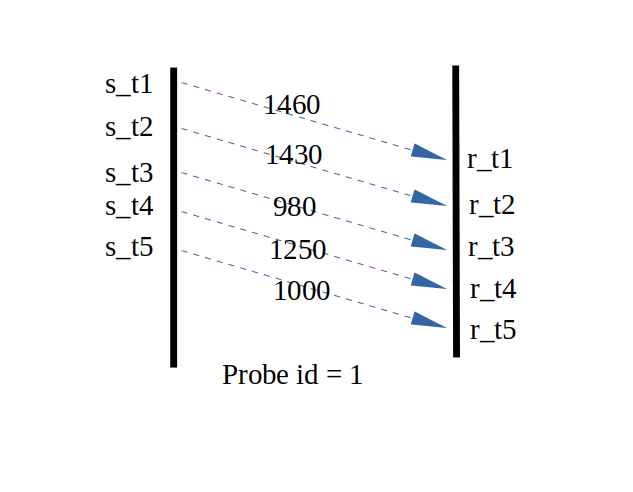

---

### Probe
webrtc使用gcc（google congestion control）来估计带宽，控制当前的发送速度。gcc中基于丢包和基于延迟的算法有个特点：
* 1.能迅速响应带宽的衰减
* 2.不能迅速响应带宽的增加

举个例子，如果当前带宽是20mbps，由于其它因素，带宽骤降至15mbps，gcc能快速的给出over-using信号(rtt为10ms环境下，响应速度是100-200ms)。

如果当前带宽是20mbps，由于其它因素，带宽升至了25mbps，依赖gcc自身的调整的话需要几十秒的时间（加性增减性乘的效果）。

由于以上的原因，如果从0bps开始运行gcc算法（纯算法本身），要达到一定的带宽需要太长的时间。

webrtc中有一个用来在起始阶段（或周期性）迅速探测到当前带宽的措施---就是Probe模块，和TCP的慢启动比较像啦！

### 原理
Probe的原理简单说起来就是这样的：发送端以一定的速度发送数据包，同时记录这些数据包的发送时间、序列号（全局唯一）、探测组的id.

接收端每过一段时间（50-150ms）会反馈数据包的到达时间，就像这样：


s_t表示发送时间、r_t标识接受时间，这样我们就知道了发送速度、接收速度:

```C++
//发送端发送这些数据包的时间间隔
common::TimeDelta send_interval = common::TimeDelta(state.last_send - state.first_send);
//接收端接收这些数据包的时间间隔
common::TimeDelta recive_interval = common::TimeDelta(state.last_recive - state.first_recive);
//发送的字节数(已发送的字节减去最后一个数据包的字节，不难理解吧?)
size_t size_send = state.size_total_sent - state.size_last_sent;
//接收端收到的字节数(已接收的字节减去第一个数据包的字节，不难理解吧?)
size_t size_recive = state.size_total_recived - state.size_first_recived;
//从而就得到了双方的速度
common::DataRate send_bps = 1_bps * (size_send * 8 / ( send_interval / 1_sec));
common::DataRate receive_bps = 1_bps * (size_recive * 8 / ( recive_interval / 1_sec));
```

我们定义S1为发送速度，R1为接收速度，那么可以认定当前的网络带宽至少是min(S1,R1)。
在这里涉及到几个问题：
* 如何控制发送端的速度
* 探测包的大小如果设置才会比较合理
* 探测应该持续多久，尽可能的避免对正常数据的影响

### 控制探测速度、包大小、探测时长
webrtc中探测包是通过一个定时器来控制速度的。

假设我们需要探测的目标速度是10mbps，探测时间是10ms，

那么我们总共需要发送的所有探测包的总大小 total_bytes = 10mbps * 15ms  / 8 ;

第一个探测包的大小取值为 bytes1 = 10_mbps * 1_ms / 8，立即发送。
为了控制速度，我们需要考虑第二个探测包的发送时间，假设是dt时间后发送，计算dt:

dt = sent_bytes * 8 /  1_mbps; 

意思就是已发送比特数 除以 目标码率，在dt的时间后发送第二个探测包，这样我们就精确地控制了发送速度就是我们希望的速度。

以这种方式发送数据包，直到"已发送字节"大于等于total_bytes，该轮探测结束。

上述中15ms就是探测需要持续的时间(可以自定义)，bytes1就是探测包的大小(通过修改"1_ms"可以自定义大小)

通过一定的手段，我们可以将正常数据流上的数据包变为探测包，减少对正常数据流的影响。

探测一般都是已当前速度的几倍去发送数据，所以必不可免的会影响当前的数据流，可以修改"15_ms"来自定义探测时长。

### 乘性探测

为了快速的探测到实际带宽的大致值，使用乘性探测。

举个例子，假设起始速度设置为450kbps，那么探测速度就设置为900kbps，如果探测结果在900kbps * 0.7 = 630kbps以上，继续向上探测，探测速度是1.8mbps，如果第二次探测结果在1.8mbps * 0.7以上，继续向上探测，探测速度是3.6mbps.....直到某一个探测结果不符合 "0.7以上"，那么就判定链路带宽应该在此次探测结果附近。

然后，以这个速度发送数据流，在这个基础上运行gcc算法，通过延迟梯度和丢包来控制发送码率。

### 实际情况

在我的实现中。在rtt 10ms的环境下，可以立刻探测到带宽上限。
运行日志如下：

```shell
probe successful,send speed:892.845kbps,receive speed:898.797kbps
probe successful,send speed:888.780kbps,receive speed:891.707kbps
probe successful,send speed:1.771mbps,receive speed:1.628mbps
probe successful,send speed:1.777mbps,receive speed:2.214mbps
probe successful,send speed:3.358mbps,receive speed:3.337mbps
probe successful,send speed:3.521mbps,receive speed:3.591mbps
...
probe successful,send speed:30.376mbps,receive speed:31.149mbps
probe successful,send speed:59.897mbps,receive speed:45.238mbps (达到带宽上限)
```
则认为当前带宽的上限是45.238mbps(我通过tc命令设置的带宽就是45mbps，探测结果非常的准)

从300kbps的起始速度上升到45mbps，用时800ms。

在实际环境中，webrtc就是通过该机制在起始阶段迅速的”跳跃”到一个合适的码率上。

### 解答
meemetao@gmail.com
