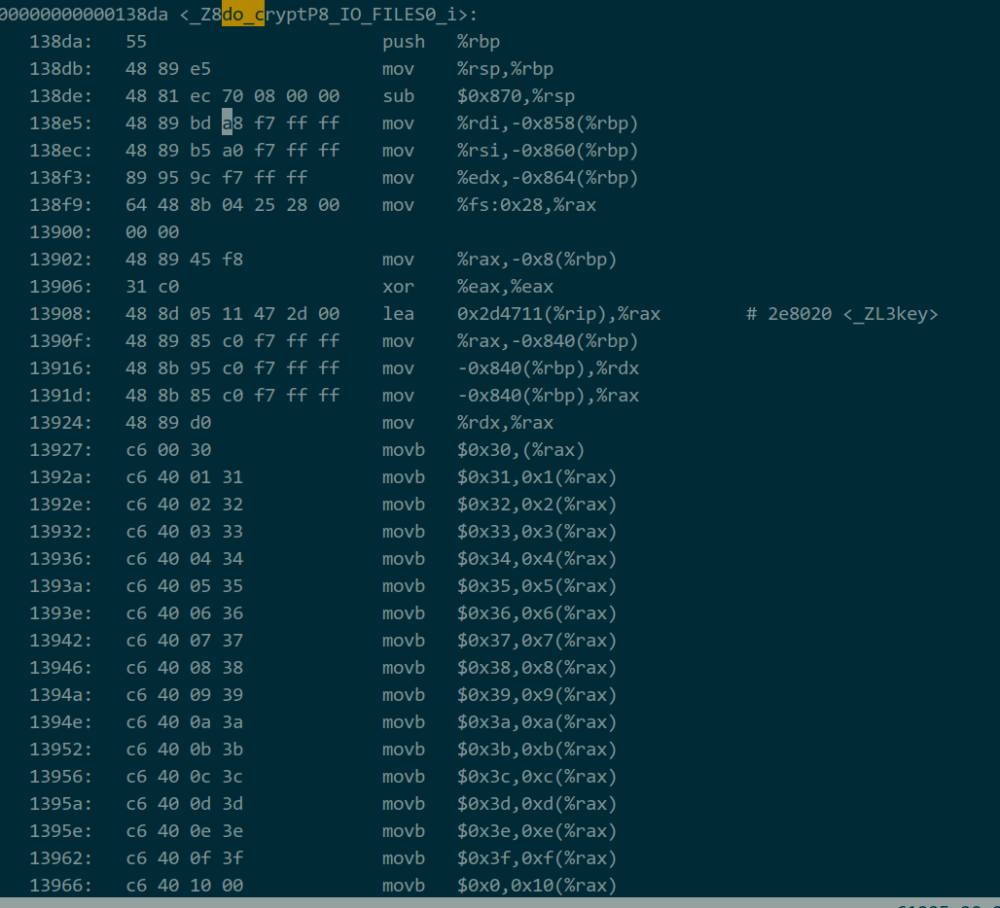
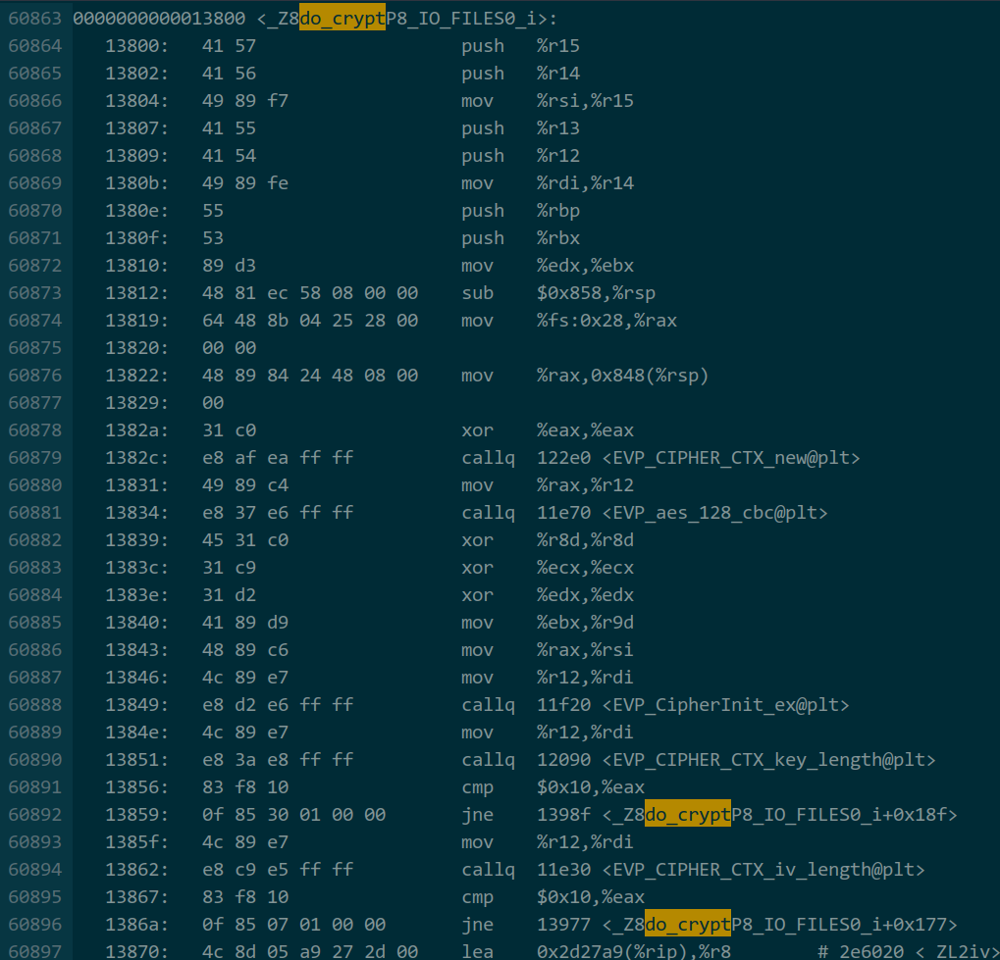

---

### 起因

之前写了一个加密工具，用来加解密本地的json配置，后来发现
加密工具的release、debug版本互相不能加解密。
起初是认为是openssl的aes-128加密算法，在"-DDEBUG"或者"-O3"选项下有不一样的行为。
后来发现是一段汇编代码被编译器优化了。

### 排查

加密的秘钥是一个全局数组:

```C++
static unsigned char key[19];
```

为了不直接暴露秘钥字符串，在加密函数中有一段内敛汇编(花指令)用来给”秘钥"赋值，这么做的原因是：
**[<<逆向工程入门指南-第50章>>](https://wizardforcel.gitbooks.io/re-for-beginners/content/Part-III/Chapter-50.html)**

```C++
    unsigned char *p = key; //取全局key地址
	asm(
		"mov %1,%%rax\n"
		"movb $48,(%%rax)\n"  //开始对key赋值
		"movb $49,1(%%rax)\n"
        "..."
        "..."
		"movb $0,16(%%rax)"  //结束
		: "+a"(p) //输出参数p，可读可写
		: "r"(p) 
	   );
    //其它c++代码
    //调用openssl加密，传入key
    EVP_CipherInit_ex(ctx,nullptr,nullptr,key,iv,opt);
```

两个不同版本(有无编译器优化选项)目标文件的汇编代码如下:

#### g++ xxx.cpp -O a.out(没有任何优化选项)


#### g++ -O3 xxx.cpp -O a.out(O3优化)


在第一个目标文件中，key被设置成了一个指定的秘钥。
而在第二个目标文件中(O3选项)，编译器认为这段内联汇编与上下文无关，很本就没有编译进目标文件。这就导致了debug（没有-O3）和release(-O3)下的秘钥不一致，互相不能加解密。

修改加密函数如下，可以解决该问题：

```C++
    unsigned char *p = key; 
	asm(
		"mov %1,%%rax\n"
		"movb $48,(%%rax)\n"  
		"movb $49,1(%%rax)\n"
        "..."
        "..."
		"movb $0,16(%%rax)" 
		: "+a"(p) //输出参数p，可读可写
		: "r"(p) 
	   );
    EVP_CipherInit_ex(ctx,nullptr,nullptr,p,iv,opt);
```

**修改key->p**，告诉编译器**上下文相关，不要优化汇编段**。


