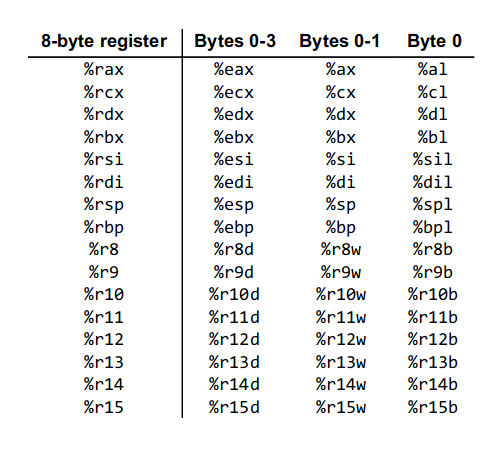
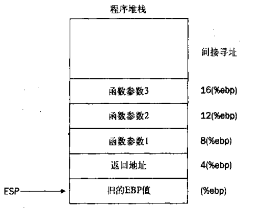
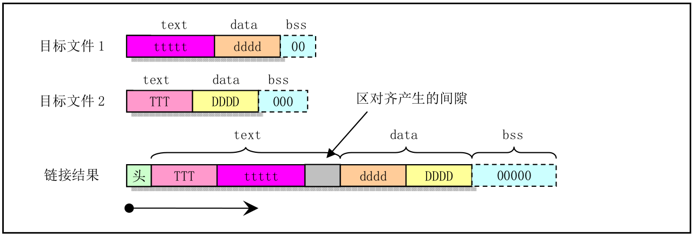

### 0. 寄存器
**通用寄存器**:

共有16个通用寄存器，如下图所示:


**Segment Register**:
* 1. CS:存放程序在内存中的基地址
* 2. DS:数据段地址(.data?)

<<Linux 0.11完全注释>>P90有关于这个的介绍

**指令指针寄存器(EIP)**
* 1. 远跳转:在分段模式下，当跳转到另一个段中的指令时
* 2. 短跳转:当跳转偏移量小于128字节时
* 3. 近跳转:除1,2外的所有其它跳转
**堆栈指针寄存器(ESP)**
* 0.指向栈顶
* 1.函数调用:通常和EBP一起配合使用

### 1. 数据段
**数据段(.data),以及.bss段**
```C++
//code1
int main()
{
    return 0;
}
//code2
int a;
int main()
{
    return 0;
}
//code3
int a = 0;
int main()
{
    return 0;
}
int a = 1;
int main()
{
    return 0;
}
```
code1\2\3的text data bss大小一样，code4的data段比123多4字节，bss段比123少4字节。

这说明：
*被显式初始化、且初值不为0的全局变量存放于.data段，为初始化的全局变量或者初始化为0的全局变量存放与.bss段。*

```C++
//code11
int main()
{
    return 0;
}
//code12
static int i;
int main()
{
    return 0;
}
//code13 
static int i = 0;
int main()
{
    return 0;
}
//code 14
static int i = 1;
int main()
{
    return 0;
}
//code 15
int main()
{
    static int i ;
    return 0;
}
//code 16
int main()
{
    static int i = 0;
    return 0;
}
//code 17
int main()
{
    static int i = 1;
    return 0;
}
```
对与static修饰的变量，从**存放位置**看，和全局变量没有任何区别:不管在局部静态变量还是全局静态变量，都按照全局变量处理。
**text 代码段**
没啥好说的。

段寄存器CS和DS用于包含代码段和数据段的地址，CS + EIP（段中偏移）就可以获取指令码的地址。
这里不做详细的介绍，<<Linux0.11>>中介绍了段管理的具体细节。

### 2. 函数
**声明函数**:
```c++
.type foo, @function
foo:
    pushl %ebp
    movl %esp, %ebp
    #code from here
    movl %ebp, %esp
    popl %ebp
    ret
```
堆栈情况:

解释：
```c++
void foo()
{
    bar(1,2);
    return;
}
```
当执行到bar(1,2)时，现将2,1参数压人堆栈然后将”return”语句的地址压入堆栈，但是为了避免在bar中出现push,pop等操作把返回地址给弄丢了，使用另外一个寄存器:ebp来存放'esp'的地址，当然还需要保存旧的ebp地址。所以函数的首部和尾部就长成了上述这样。(<<汇编预言程序设计>> P245)

还剩最后一个问题，如果函数把任何数据都压入堆栈，ESP寄存器仍然指向局部变量被存放之前的位置，并且将覆盖这些变量。为了解决这个问题，需要在函数开始的位置预留一定数量的栈空间。

### 3.链接
一段程序包含.text .data .bss 段链接器会将所有的目标文件的这些段合并在一块。


