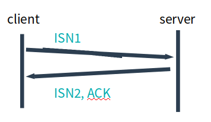

---

## 协议

为了方便描述, 给本协议起个名字, 暂且叫做 **moru** (modern reliable udp).

moru 需要支持的功能应该是如下这个样子:

- 1.建立连接和断开连接是可靠的
- 2.面向报文
- 3.支持不可靠, 半可靠和完全可靠三次方式(报文收发)
- 4.支持冗余纠错
- 5.支持bbr, cubic两种拥塞控制方式
- 6.多路复用等 tiny features

引入起始序号(ISN), 后续的报文在后面递增

### 可靠的建立连接

在moru中需要几次握手.

为了支持1 3 5, 协议头中必须包含 "序号" 和 "时间戳", 并且需要有ACK报文.

序号从0开始可以么?  不可以, 原因是: 为了避免旧连接的数据被新连接收到.

> The purpose in these sequence numbers is to prevent packets that get delayed in the network from being delivered later and then misinterpreted as part of an existing connection

因此moru中要引入TCP中的**ISN**(intial sequence number).

因此连接中的双方分别需要告诉对方自己的ISN, 这里需要交换2个报文.

引入ISN需要2个报文, 那么在网络中建立一个可靠的连接需要几个报文?

> 这个问题的本质是, 信道不可靠, 但是通信双发需要就某个问题达成一致. 而要解决这个问题,  无论你在消息中包含什么信息, 三次通信是理论上的最小值. 所以三次握手不是TCP本身的要求, 而是为了满足"在不可靠信道上可靠地传输信息"这一需求所导致的. 请注意这里的本质需求,信道不可靠, 数据传输要可靠. 三次达到了, 那后面你想接着握手也好, 发数据也好, 跟进行可靠信息传输的需求就没关系了. 因此,如果信道是可靠的, 即无论什么时候发出消息, 对方一定能收到, 或者你不关心是否要保证对方收到你的消息, 那就能像UDP那样直接发送消息就可以了

因此三个报文就可以满足"可靠的建立连接", 并且引入 SYN, ACK两个标记.

**下面分析三次握手中的server端流程**

server 收到一个 SYN 之后, 取出client的ISN 作为ack, 并且发送自己的ISN:

然后持续等待, 在这过程中可能遇到:

- 收到对方的正确的ack, 那么连接顺利建立
- 再次收到对方的SYN, ISN是同一个, 重发 SYN, ACK
- 再次收到对方的SYN, ISN不是同一个, 执行listen流程
- 收到了对方的数据,但是ack的序号不对. 忽略, 并且重发 SYN, ACK

