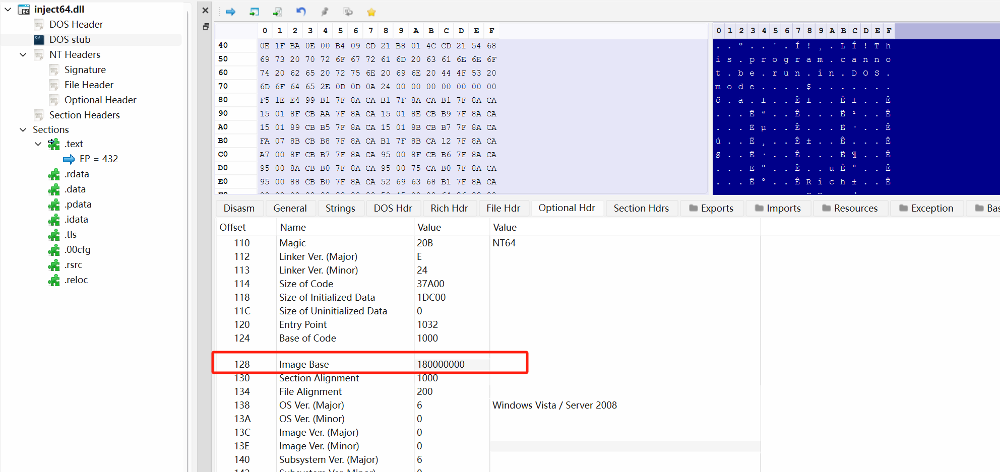
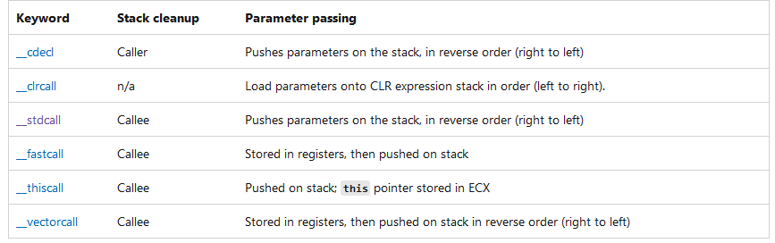

---

## 查看变量

* dv, Display Variable的缩写, 查看局部变量.
* dv /i, 查看局部变量, 并显示符号的类型和参数类型.
* dv /V, 查看局部变量, 并显示变量的存储位置.
* dv /V VariableName, 指定需要查看的变量的名字
* dt, Display Type的缩写. 当变量的类型为复合类型, 比如说结构体或者类, 那么dv命令只会显示变量的地址. dt命令可以将一块内存按照某个数据类型来解析, 其中的数据类型需要作为参数被传递给dt命令. (dt this)

## 线程相关

* ~,  简洁的显示当前进程的所有线程
* ~., 表示当前进程
* ~1, 表示一号线程
* ~2 s, 选择2号线程作为当前线程
* ~* k, 打印所有线程的调用栈
* .frame 1, 切换到第一个栈帧

## 断点


deferred的意思是"还没加载", 这时候需要用bu命令。

断点支持三种语法, 虚拟地址、函数偏移、源码:
```shell
0:000> bp 0040108c
0:000> bp main+5c
0:000> bp `source.c:31`
```
对C++成员函数来说:
```shell
0:000> bp MyClass::MyMethod
0:000> bp MyClass__MyMethod
0:000> bp @@( MyClass::MyMethod )
```

源码路径的语法：
```shell
`[[Module!]Filename][:LineNumber]`
```
如果文件名相同, 需要加上上一级目录的名称予以区别, 否则就用第一个匹配的。

总的来说, windbg的断点难用的很。

条件断点的语法更是惨绝人寰，不建议使用。

## Reading and Writing Memory

内存可以通过地址或者变量名直接引用。

读命令: d*(d是display的意思)





```shell
# mmhighestuseraddress是一个变量, 查看这个变量的地址
kd> dp nt!mmhighestuseraddress L1
81f71864  7ffeffff
```
这表明用户态的地址空间上限是0x7FFEFFFF(32位系统)

## 内存相关

查看内存使用情况:
* !address -summary

查看堆详情:

* !heap -s 查看堆详情

图片

* !heap -stat -h 堆地址  打印这个堆的使用情况
* !heap -flt s [堆size]  打印size大小的堆的数量、地址
* !heap -p -a 堆地址  打印这个堆是哪个函数申请的

## 排查野指针

前提: 开启Gflag全页堆

```c++
// 堆栈
VZVCamDshow!DllMain+0xd8d:
00007ffe`7270313d 8982d8000000    mov     dword ptr [rdx+0D8h],eax ds:00000267`e03d0fd8=????????
```
访问 00000267`e03d0fd8时crash, 先看一下这个地址的情况。

>> !address 00000267`e03d0fd8


```shell
Usage:                  PageHeap
Base Address:           00000267`e03cf000
End Address:            00000267`e03d2000
Region Size:            00000000`00003000 (  12.000 kB)
State:                  00002000          MEM_RESERVE
Protect:                <info not present at the target>
Type:                   00020000          MEM_PRIVATE
Allocation Base:        00000267`e0160000
Allocation Protect:     00000001          PAGE_NOACCESS
More info:              !heap -p 0x267fbcd1000
More info:              !heap -p -a 0x267e03d0fd8
```

## 句柄泄露

分析命令
1、!htrace -enble。
2、执行重现过程，让进程句柄泄漏
3、通过!htrace -diff 找出有问题的栈。

## 参考文档
* https://learn.microsoft.com/en-us/windows-hardware/drivers/debugger/using-umdh-to-find-a-user-mode-memory-leak
* https://learn.microsoft.com/en-us/windows-hardware/drivers/debuggercmds/-heap
* https://www.codeproject.com/Articles/6489/Debug-Tutorial-Part-3-The-Heap
* https://bsodtutorials.wordpress.com/2014/01/06/debugging-heaps-and-heap-internals-part-2/
* https://icepng.github.io/2017/02/25/HeapAlloc/
* https://blog.csdn.net/hgy413/article/details/7620599
* https://illmatics.com/Understanding_the_LFH_Slides.pdf
* https://www.i.u-tokyo.ac.jp/edu/training/ss/lecture/new-documents/Lectures/16-UserModeHeap/UserModeHeapManager.pdf
* https://www.rapid7.com/blog/post/2019/06/12/heap-overflow-exploitation-on-windows-10-explained/
* https://illmatics.com/Understanding_the_LFH.pdf
* https://www.blackhat.com/docs/us-16/materials/us-16-Yason-Windows-10-Segment-Heap-Internals.pdf
* https://cs.wellesley.edu/~cs240/f16/slides/allocator.pdf
* https://stackoverflow.com/questions/50711102/how-is-the-header-of-a-block-formatted-in-heap


