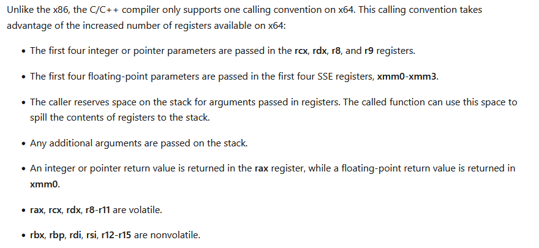

---

## windows线程

线程包含三个东西:

* Thread Kernal Object
* Stack
* TEB

### 内核对象：



### Thread Context

* 寄存器状态: instruction pointer(指令地址) and stack pointer registers(栈地址)
* TEB: This field contains a pointer to the Thread’s Environment Block.
* others

### Thread Stack

线程栈就是系统分配的一块内存，用来保存函数的局部变量、传给函数的变量


每个线程有2个栈, 一个在内核态，一个在用户态（https://www.cnblogs.com/5iedu/p/4888094.html）

用户态的栈空间默认是1MB。

内核态的栈常驻RAM(如果线程处于Running或者Redy状态)，32位系统下是12KB，64位系统下是24KB。

### Thread Environment Block (TEB)

TEB是一块系统分配的内存（用户态地址，可以被应用程序访问）, 这块地址总共是1个PAGE(4KB x86|x64)


2个特别重要的数据:

* SEH(结构化异常)的头(第一个try)
* 线程局部变量
* 其他：


TEB的地址可以可以通过访问FS寄存器得到:
```c++
#include <intrin.h>
#include <winternl.h>

void *getTIB() {
#ifdef _M_IX86
    return (void *)__readfsdword(0x18);
#elif _M_AMD64
    return (void *)__readgsqword(0x30);
#else
#error unsupported architecture
#endif
}
```


### 线程栈的大小

有多种方式指定线程栈(用户态)空间的大小: 编译选项、链接指令、CreathreadEx参数
C++的 std::thread不支持修改。

### 模拟与观察栈溢出

```c++
#include <winternl.h>

// 先查看线程栈的基地址
void PrintThreadStackBaseAddress() {
    NT_TIB* ptr = (NT_TIB*)getTIB();
    std::printf("base address: %p", ptr->StackBase);
}

void StackOverFlow() {
    uint8_t buffer[1024 * 1024 - 15 * 1024] = {0};
    StackOverFlow();
}

int main() {
    PrintThreadStackBaseAddress();
    // GetThreadStackInformation();
    StackAddressOrder();
    StackOverFlow();
    int a;
    std::cin >> a;
    return a;
}
```


默认情况下栈大小是1MB，所以在最后的4KB（一页）上发生栈溢出（猜测）。

## CRT中的栈地址检查函数

系统分配内存的时候并不会直接分配，而是等到发生缺页异常的时候（写某个地址）。那么久存在一个问题:

```c++
// sizeof(int) * 5KB 要分配整个空间么?
int a[1024 * 5] = {0};
a[0] = 1;
```
a[0] 处于栈的低地址(注意栈的增长方向)属于尚未分配的页, 为了解决这个问题, 编译器会插入栈检查函数，也就是说上面那个__chkstk()函数，这个函数的代码如下：
```c++
   102: _chkstk endp
   103:
   104:         end
   105:
00007FF7DC53302A  and         r10w,0F000h
   105:
00007FF7DC533030  lea         r11,[r11-1000h]
   105:
00007FF7DC533037  mov         byte ptr [r11],0
   105:
00007FF7DC53303B  cmp         r10,r11
   105:
00007FF7DC53303E  jne         cs10 (07FF7DC533030h)
   105:
00007FF7DC533040  mov         r10,qword ptr [rsp]
   105:
00007FF7DC533044  mov         r11,qword ptr [rsp+8]
   105:
00007FF7DC533049  add         rsp,10h

// 伪代码：

void StackCheck(int nBytesNeededFromStack)
{
    //获得栈顶指针，此时栈顶指针还没减去“局部变量”所示的空间大小
    PBYTE pbStackPtr = (CPU's stack pointer); //CPU栈顶指针
    while(nBytesNeededFromStack >= PAGESIZE)
    {
        //将栈顶指针移到PAGE_GUARD页面
        pbStackPtr -=PAGESIZE;

        //访问1个字节，以强迫系统调拨下一个页面
        pbStackPtr[0] = 0;

        //剩下需要调拨的字节数
        nBytesNeededFromStack -= PAGESIZE;
    }
    //用返回之前，StatckCheck函数将CPU的栈顶指针设置在调用函数
    //的局部变量下
}
```

检查代码的原理很简单：每次试图访问下一个页面中的某个地址，以使系统自动为它分配调拨内存，直到需要的栈空间都满足为止。当然如果预设的栈空间不够的话，还是会先引发溢出异常。

### 结构化异常(SEH)

* 访问违规
* 除0
* 栈溢出
* ...
基本用法:
```c++
__try {
    // 可能触发异常的代码
}
__except(EXCEPTION_EXECUTE_HANDLER) {
    // 异常处理逻辑
}
```

异常链: SEH 维护了一个**线程私有**的异常链，保存在 TEB 的 ExceptionList 中（TEB->NtTib.ExceptionList）。
```cpp
typedef struct _NT_TIB {
    struct _EXCEPTION_REGISTRATION_RECORD *ExceptionList;
    // ...
} NT_TIB;

typedef struct _EXCEPTION_REGISTRATION_RECORD {
    struct _EXCEPTION_REGISTRATION_RECORD *Next;
    PEXCEPTION_DISPOSITION (*Handler)(   // 函数指针
        struct _EXCEPTION_RECORD *ExceptionRecord,
        void *EstablisherFrame,
        struct _CONTEXT *ContextRecord,
        void *DispatcherContext
    );
} EXCEPTION_REGISTRATION_RECORD;

```
Windows 的异常调度流程：
* CPU 遇到异常（如访问违规），引发 trap
* 内核调用 KiDispatchException，判断是用户态还是内核态
* 如果是用户态异常，则调用 NtRaiseException → 进入 RtlDispatchException
* 从 TEB->ExceptionList 开始，依次调用每个 Handler
* 每个 Handler 返回一个 EXCEPTION_DISPOSITION
* ExceptionContinueExecution: 忽略异常，恢复执行
* ExceptionContinueSearch: 不处理，继续找下一个处理器
* ExceptionNestedException: 嵌套异常，较复杂
* 如果链表遍历到底都没人处理，则抛给 UnhandledExceptionFilter
* 最后调用 NtTerminateProcess 终止进程（或进入调试器）

### C++ 异常

C++ 异常是基于**栈展开（stack unwinding）**的。流程如下：
```cpp
try {
    funcA();
} catch (const std::exception& e) {
    // 处理异常
}
```

当 funcA() 抛出异常时：
* 异常对象构造（通过 throw 表达式）
* 异常传播：从当前函数开始查找匹配的 catch 块
* 栈展开：依次调用每个栈帧的析构函数（RAII 保证）
* 匹配 catch：类型兼容时跳转进入相应的 catch 处理逻辑

MSVC 编译器默认将 C++ 异常构建在 SEH 之上，具体来说：

| 构件                | 说明                                             |
| ------------------- | ------------------------------------------------ |
| `throw`             | 调用 `_CxxThrowException()`（在 `vcruntime` 中） |
| `_CxxFrameHandler3` | 每个函数的 EH 信息处理器（在异常时被 SEH 调用）  |
| `.pdata/.xdata` 段  | 每个函数的异常处理元数据，用于匹配 catch         |

_CxxFrameHandler3 由 Windows SEH 调用，在发生异常时负责：
* 是否为 C++ 异常？
* 栈展开与析构？
* 匹配 catch 块？

| 问题                       | 解答                                                                          |
| -------------------------- | ----------------------------------------------------------------------------- |
| C++ 异常如何传递？         | 通过 `_CxxThrowException` 抛出，沿调用栈查找匹配的 `catch`，过程中析构对象    |
| 抛出时会泄露资源吗？       | 不会，符合 RAII 的资源都会被调用析构函数释放（但裸指针资源会泄露）            |
| 异常能跨线程吗？           | 不可以，异常不能越过线程边界，`throw` 出去必须在同一线程 `catch`              |
| SEH 能 catch C++ 异常吗？  | 不行，`__except` 无法捕获 `throw` 抛出的异常，反之亦然                        |
| C++ 异常一定会崩溃程序吗？ | 不一定，未捕获异常会调用 `std::terminate()`，你可以自定义 `terminate_handler` |

一些进阶特性:

| 特性                     | 说明                                                                                                          |
| ------------------------ | ------------------------------------------------------------------------------------------------------------- |
| `noexcept`               | 标记函数不可抛出异常，编译器会插入崩溃代码（`std::terminate()`）                                              |
| `std::exception_ptr`     | 异常对象跨线程传递方式                                                                                        |
| `std::rethrow_exception` | 延迟处理异常                                                                                                  |
| 异常匹配顺序             | 从上往下匹配，支持类型兼容性，如 `catch(std::runtime_error&)` 也能匹配 `throw std::logic_error()`（因为继承） |

**敲重点: SEH不能捕获C++异常**

* C++ 异常：用于业务逻辑错误、运行时异常等
* 用于捕捉CPU 异常或访问冲突等硬件级异常

来源不同：

| 源头                                | 属于哪类异常 |
| ----------------------------------- | ------------ |
| `throw`                             | C++ 异常     |
| 除 0 / 空指针                       | SEH 异常     |
| WinAPI 抛出异常（`RaiseException`） | SEH 异常     |

是否析构对象：

| 异常类型 | 栈展开时析构对象？        |
| -------- | ------------------------- |
| C++ 异常 | ✅ 是，标准 RAII 流程      |
| SEH 异常 | ❌ 否，不调用 C++ 析构函数 |

小结对比：

| 特性         | C++ 异常（try/catch）                      | Windows SEH（\_\_try/\_\_except）   |
| ------------ | ------------------------------------------ | ----------------------------------- |
| 主要用途     | 应用级逻辑错误处理                         | 系统级错误（如访问冲突）            |
| 是否安全析构 | ✅ 是（RAII）                               | ❌ 否                                |
| 内部机制     | `_CxxThrowException` + `_CxxFrameHandler3` | SEH 异常链（fs:\[0]）               |
| 可以混用？   | ❌ 推荐避免                                 | 有风险（尤其在带有 C++ 局部变量时） |
| 兼容性       | 跨平台（标准 C++）                         | 仅限 Windows                        |
