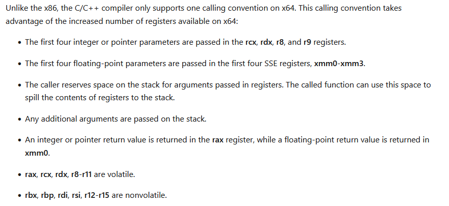

---

## 寄存器

32位操作系统的寄存器:


大部分EXE都是64位了, 这里只记录64的情况:


**MSVC使用RSP作为栈顶指针(注意栈的增长方向)。**

## 函数调用约定


C/C++代码默认使用__cdecl约定。x86的程序中, 参数的转递是靠栈, x64中参数的传递是靠寄存器, 只有当参数个数大于6时才回使用栈。




## 函数调用过程

```c++
class FunctionCall {
public:
    void foo(int a1, int a2, float f1, float f2, int a3, int a4, int a5) {
        std::printf("a1:%d, %d, %0.2f, %0.2f, %d, %d, %d\n", a1, a2, f1, f2, a3, a4, a5);
    }

private:
    int a_ = 0;
};

int main() {
    FunctionCall call;
    call.foo(1, 2, 3.0, 4.0, 5, 6, 7);
    return 0;
}

```

汇编代码解释：

```nasm
00007FF7DEB96E14  lea         rcx,[call] 
00007FF7DEB96E19  call        FunctionCall::FunctionCall (07FF7DEB91299h)  
00007FF7DEB96E1E  mov         dword ptr [rsp+38h],7  # 参数入栈, 注意入栈顺序
00007FF7DEB96E26  mov         dword ptr [rsp+30h],6  
00007FF7DEB96E2E  mov         dword ptr [rsp+28h],5  
00007FF7DEB96E36  movss       xmm0,dword ptr [__real@40800000 (07FF7DEB9B144h)]  # 浮点数放到xmm0-xmm3寄存器
00007FF7DEB96E3E  movss       dword ptr [rsp+20h],xmm0  
00007FF7DEB96E44  movss       xmm3,dword ptr [__real@40400000 (07FF7DEB9B140h)]  
00007FF7DEB96E4C  mov         r8d,2  #因为只有2个整形, 所以只用了edx和r8寄存器
00007FF7DEB96E52  mov         edx,1  
00007FF7DEB96E57  lea         rcx,[call]   #取call变量的地址,也就是this指针的值到rcx寄存器
00007FF7DEB96E5C  call        FunctionCall::foo (07FF7DEB91294h) # call
```