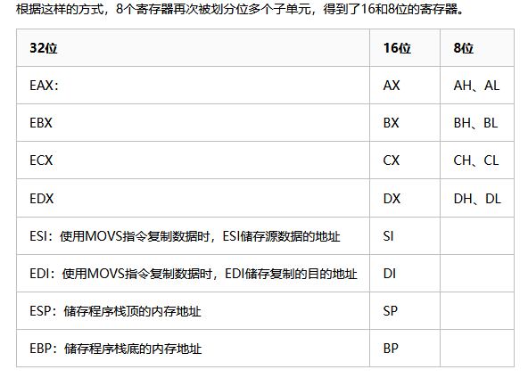
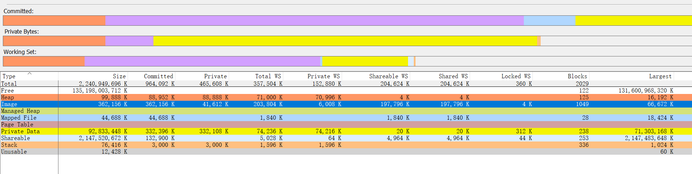

layout: mypost
title:  "Windows中的内存"
date:   2025-04-20 11:13:17 +0800
categories: windows
location: HangZhou,China
description:
---
---

### 概要

此文记录windows中的内存。

### 从对比两个进程的内存分布说起

有个事情是这样子的，程序临近发版突然发现V2版本的内存绝对值比V1版本增加了30MB。

各模块负责人都坚称自己的修改不会引入额外的内存，于是领导让我搞清楚是哪里占用了更多的内存。

用VMMap打开两个进程, 来观看两个进程的内存分布：

V1:

V2:

比较清晰的看到了V2版本的Image区域比V1版本多了46MB, 大概就是这个区域里面有个新增的dll影响了进程的内存大小（任务管理器中见到的）

对比这两个版本加载的dll, 发现V2比V1新增了一个nvoglv64.dll。

各个模块的同学很多时候可能是无意调用了第三方库导致了新dll的加载，他自己也不知道。必须要进一步确定这个dll是由哪段代码加载的才能找到相应的同学来排查。

Windbg加载V2进程并设置好PDB路径:

> lm #打印此时加载的dll列表发现没有这个nvoglv64.dll

> sxe ld:nvoglv64.dll #当这个dll加载时中断

> go #继续跑, 出现断点的时候打印函数栈就一目了然

###