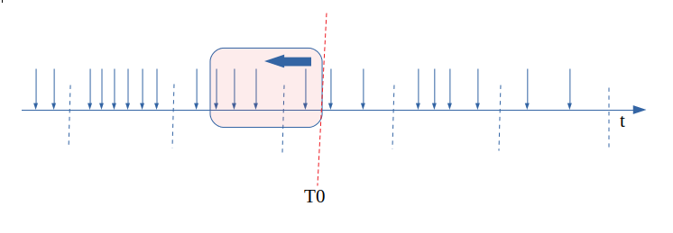
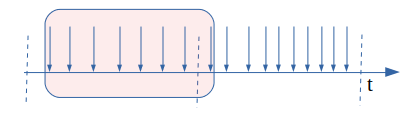
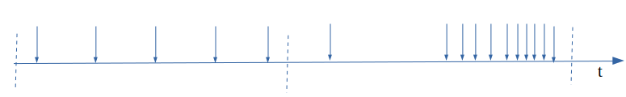
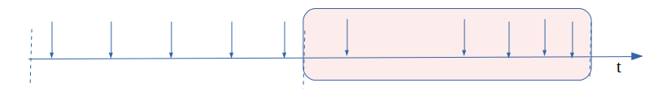
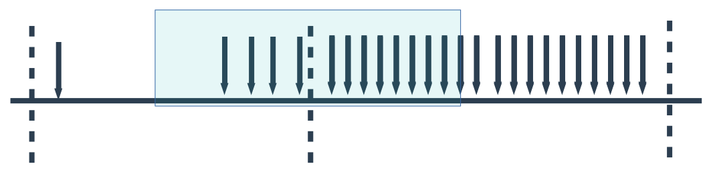
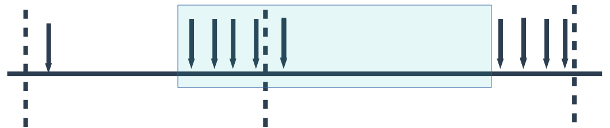

---

抽帧分为 fps过高抽帧和 实际编码码率过高抽帧, 这里先讨论fps过高引起的抽帧.

### 需求

视频输入是0-60帧, 基于某些原因需要精确控制输出fps的值.

模型如下:

视频帧输入------->抽帧-------->输出到编码器

比如, 输入fps=60, 目标输出fps=30. 这个时候就存在2种完全不同的方法:

- 定时器33ms醒来一次, 取最新更新出的输入帧(需要缓存在某个地方)送去输出
- 每隔2个输入, 产生一个输出

方法1的好处是可以非常平滑且精确的控制输出FPS, 但是存在延迟(输入没法立即送去输出).

方法2几乎没有延迟, 输入可以立刻送去输出. 问题在于

- 如何完成"跳帧"的判断(上例中的"每隔2个输入")
- 当out-fps 不是 in-fps的整数倍, 或者 out-fps < in-fps的时候如何处理.

考虑当前代码结构和性能问题, 必须选择方法2.

### 计算实时fps

一个很自然的想法是使用一个1秒长度的窗口去"盖住"历史,计算窗口内的记录.如下图:

在T0点的FPS = 4.

### 如果输入是均匀的

情况1: in-fps 大于 out-fps

> 例: 输入fps = 10, 目标fps = 7

为了解释算法是如何工作的, 需要先假设上一秒内算法工作的很好(保留下了相对均匀的7帧)

进入第二秒后, 该窗口"盖住"了8帧, 如果允许这一帧输出,那么输出FPS=8 > 7, 因此需要将该帧丢弃

紧接着,在下一帧输入的时候继续判断,窗口"盖住"了7帧, 符合,将该帧送去输出.

按照这个方式, 输入的10帧会被每隔2-3帧丢掉1帧, 最终只留下7帧.

情况2: in-fps 小于 out-fps

> 例: 输入fps = 10, 目标fps = 15

任何时刻窗口"盖住"的帧都不会超过15(最多等于10), 因此不会丢弃任何输入帧.

### 如果输入是不均匀的

> 例: 输入fps = 20, 目标fps = 5

为了解释问题是如何产生的, 仍旧需要先假设上一秒内算法工作的很好(保留了5帧):

进入第二秒后, 输入的视频帧不均匀, 主要集中在后半段, 按照之前的运行机制抽帧后会在
后半段保留4帧, 前半段保留一帧, 这是没有问题的(因为输入本身就不均匀):

进入第三秒后, 输入的视频帧变得均匀:

但是上一秒的后半段已经输出了4帧, 导致这一秒的前半段只能产生1帧, 并且在后半段连续输出4帧:

这时候因为这个机制导致了:输入是均匀的, 输出却变成了不均匀并且无限循环下去.

### 解决(缓解)方式

目前的做法: 计算fps的时候, 不仅统计过去1秒的视频帧数量 n1, 还统计过去250ms的视频帧数量n2

最终的:

$$ fps = max({n1, \frac{n2 * 1000}{250}}) $$

但是这种做法会导致第一个周期后半段的输出不足4帧, 并且仍旧会有小卡顿.

其它方法:

- 将固定的 1000 ms窗口改为" 500ms-1000ms"内的随机数, 每次都重新产生. 这种方法能够将"聚集"逐渐打散 (还没试)
